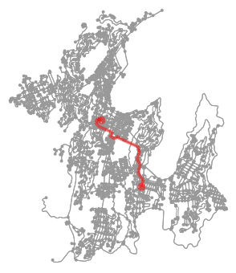
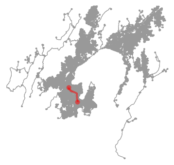
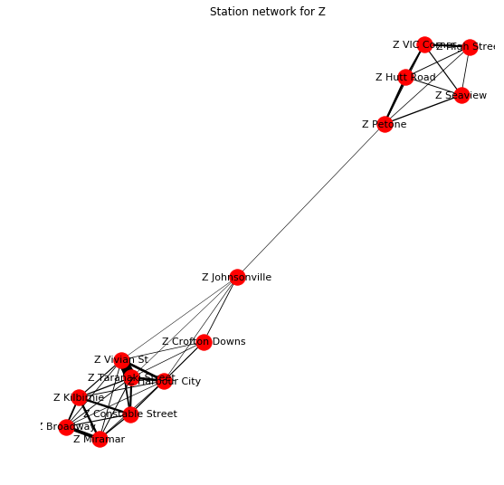
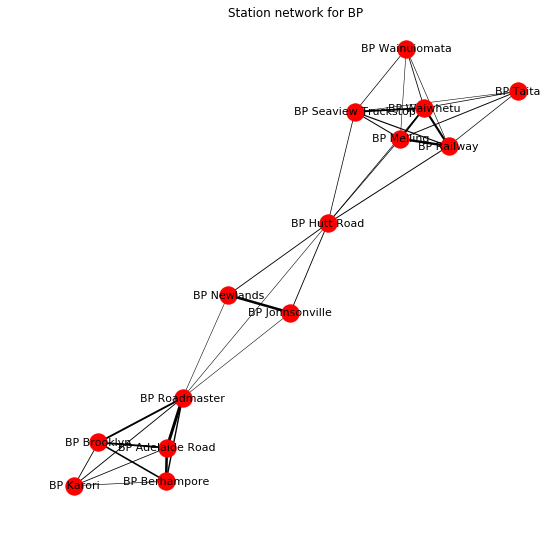
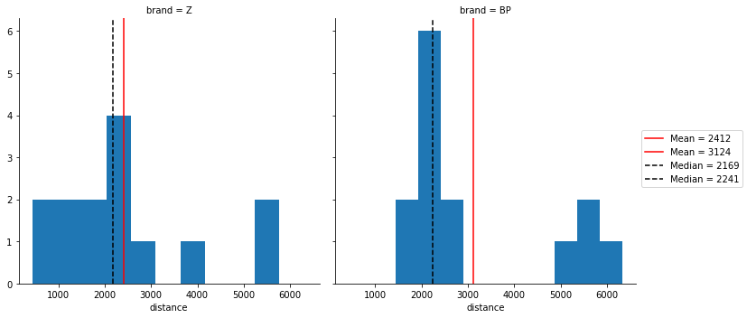

In the [previous post](https://shriv.github.io/Fuel-Stations-Analysis-Part-1/), we obtained and plotted locations of Z and BP stations in Wellington, New Zealand. We could see some differences in the coverage of Z vs. BP but there was no articulation of these differences. In this post, we'll use network analysis to generate a structural picture of the two fuel station networks. We'll also compare the two brands with commonly used network metrics.

We build up the abstract network in 4 steps:
- Get fuel stations in region
  - Done in the previous post

- Find nearest neighbours within radius, r
  - Calculate the best route / as the crow flies distance between every fuel station pair.
  - Only consider fuel stations as nearest neighbout if within a certain radial distance (e.g. 10 km)

- Connect nearest neighbours
  - Connect nearest neighbour stations with an edge; with an edge weight equal to the distance.

- Abstract to a network without geolocation

We can think of the abstract network of a different data structure and this format allows for some novel characterisation of the fuel station coverage. The ones considered here are:
- Average inter-station separation distance
- Neighbour analysis: own brand / competitor

These metrics quantify the interaction  between Z and BP fuel stations and they help build a picture of coverage.

## Introduction to street network analysis
To construct the abstract network, we first need to calculate the best route (and its distance) between every pair of fuel stations in the network. With the OSMnx (a portmanteau acronym of Open Street Maps, OSM, and NetworkX, nx) package, we can superimpose entities with geolocation on the spatial network. Once we've done this, we can find a path (route) connecting any two nodes. Because of the representation constraints, we don't find the route between the 2 specific entity coordinates (like Google Maps) - instead, we find the path between two nodes closest to the entities.

The underlying representation used by OSMnx is a reduction of streets and roads to edges with intersectionsas the vertices (or, nodes). This representation is also known as a 'Primal Graph'. The position of the nodes and the trajectory of the edges are further described with geolocation coordinates. The technical aspects are presented in [this paper](https://arxiv.org/pdf/1611.01890.pdf) by Geoff Boening: the author of OSMnx.

The route between the nodes uses the edges (streets and roads) of the spatial network. The route calculation algorithm is an analogue of the [typical shortest path analyses done in network science](https://en.wikipedia.org/wiki/Shortest_path_problem). In our spatial network, the path length can be equated to distance. The base unit of length is metres.

### Simple example: route between Z Kilbirnie and Z Vivian St
The following example looks at the distance and route between two Z stations: Z Kilbernie and Z Vivian St. The red line in the figure is the shortest route that connects the two stations. From the street shapes, you can see that the route is wending it's way around Evans Bay and Basin Reserve, before entering the central city street grid. This route has a distance of 4.6 km - a value that corresponds quite closely to that given by [Google Maps](https://bit.ly/2Mvjr0L).

*Shortest distance between Z Kilbirnie and Z Vivian St is 4577.443 m*

### Get street network for Wellington
 In the toy example, I only downloaded the street network within a 5km radius of Z Kilbirnie. For the main analysis though, we want all the streets and roads within the defined bounding box. The updated figure now shows the route between Z Kilbirnie and Z Vivian St overlayed on all the roads in the Wellington + Lower Hutt bounding box.  

*Shortest distance between Z Kilbirnie and Z Vivian St is 4268.96 m*

## Abstract networks
To construct the abstract network, we first calculate the route and distance between all possible pairs of the 13 Z stations in the region. The following table shows a subset of the results. We see distances from several Z stations to Z Broadway (in Strathmore).

|distance|id_from|from|id_to|to|1|2|3|4|5|
|--- |--- |--- |--- |--- |--- |--- |--- |--- |--- |
|2822.644|3120151445|Z Kilbirnie|5821475056|Z Broadway|
|1332.762|5821475059|Z Miramar|5821475056|Z Broadway|
|4002.103|5821475061|Z Constable Street|5821475056|Z Broadway|
|5644.063|5821475058|Z Taranaki Street|5821475056|Z Broadway|
|5744.885|5544110098|Z Vivian St|5821475056|Z Broadway|

The table of pairwise distances can now be used to analyse the number of neighbours for a Z/BP station within a particular radius and recast into a network structure. The recasting is useful since we can use some standard network analysis tools available in the networkx package.

The steps of the recasting are:

- Filter the pairiwse distance table to only include separations less than or equal to 10km. This step would remove the connection between Z Broadway and Z Petone for example.
- Store the filtered distance table as a network data structure. This means:
  - Stations become nodes
  - Any node within 10km becomes a connecting edge
  - The distance between the nodes is stored as a weight - with shorter distances having a higher 'weight'
- Remove the geolocation information for the nodes

We can visualise the network structure of the simpler, recast data. The weighted edges come in useful since closer nodes have thicker edges and are closer together than nodes that are further away. Some interesting insights include:
- 2 components are apparent in the Z station network for Wellington: Wellington City and Lower Hutt.
- The Z Wellington City component is very tightly connected for the central and southern suburbs.
- The connectivity of the Z Wellington City component reduces for the northern stations. The table of connections shows that stations in the southern suburbs are connected to two more stations than the northern suburbs and Lower Hutt.
- BP stations in the northern suburbs are a little better connected.
- The BP Wellington component is not as well connected as the Z station Wellington City component.
- The BP Lower Hutt component is much better connected than Z. BP also has 2 more stations in Lower Hutt compared to Z.

| Z network | BP network |
|:---:|:---:|
|||

All these points indicate that while Z and BP cover similar areas of Wellington, *Z is better represented in Wellington City while BP dominates in Lower Hutt*. It would be very interesting to see if revenue per station is signficantly different for a Z station in Wellington City vs. Lower Hutt.

### Z Network analysis: degree
Because the Z station network was a loosely connected network with two strongly connected components, we can calculate the average degree per component, without much loss of accuracy. The BP network doesn't have the same structure - BP stations are reasonably well connected throughout the Wellington region network - so we can't analyse the BP components separately..

The explicit connectivity of each Z station is given by a metric called 'degree' in network analysis. The degree distribution is useful for understanding characteristics of structure in larger &/ complex networks. Here, it's simply useful to use the node degree to understand the highly connected / central Z stations. As expected, these stations are the ones in the city centre: Z Harboour City, Z Vivian St, Z Taranaki Street.

|station|degree|
|--- |--- |
|Z Harbour City|8|
|Z Vivian St|8|
|Z Taranaki Street|8|
|Z Constable Street|7|
|Z Miramar|6|
|Z Broadway|6|
|Z Kilbirnie|6|
|Z Crofton Downs|5|
|Z Petone|5|
|Z Johnsonville|5|
|Z Hutt Road|4|
|Z High Street|4|
|Z VIC Corner|4|
|Z Seaview|4|

The average degree / connectivity for the Wellington City Z stations is much higher than Lower Hutt. The typical Z station in Wellington City is connected to 2 more Z stations than a typicsl Z station in Lower Hutt.   

- Z stations in Wellington region have an average of 5.71 neighbours
- Z stations in Wellington City have an average of 6.5 neighbours
- Z stations in Lower Hutt have an average of 4.67 neighbours

## Nearest neighbours: Inter-station separation
We can further reduce the pairwise distance matrix to the closest neighbour per statiion to calculate the average distance between any two Z stations. A more academic name for this metric is: *average inter-station separation*.

The plots show that the physical coverage of Z vs. BP stations using the inter-station separation distances is asymmetric. There is also some indication of a *bimodal* distribution: a cluster of stations that are very close together and another cluster that are further apart. The difference between the two modes seems to be larger for BP.

From this comparison, we can say that Z stations are better spread in the Wellington region compared to BP. We need to exercise some caution however; with only ~13 stations, we don't have much sample size. If we do a more complete analysis for Z, we can get robust statistics by running a hierarchical model for the average inter-station separation across the different types of regions. Until then, we just have to be mindful of how strongly we present this message.

Average (mean) inter-station distances:
- Z stations in Wellington are 2.412 km apart on average
- BP stations in Wellington are 3.125 km apart on average

## Nearest neighbours: same brand / competitor?

A key characteristic of good coverage is location in relation to other entities - especially competitors. A simplistic view of good coverage is that a franchise should ideally be placed close to one of its own rather than near a competitor. Some comparative analyses that explore the type of nearest neighbour include:
- Seeing whether Z stations neighbour each other or a competitor
- Which Z stations are in a zone of poaching risk - i.e. their customers might go to a nearby competitor.

For this analysis, we need to generate the shortest distances between all station pairs for *both* Z and BP stations together. Unfortunately, the computation is not fast and needs to better managed in the future for a larger dataset. Also, note that there is an implicit redundancy in the numbers cited below: some station pairs are each others nearest neighbours.

|from|to|distance|from_brand|to_brand|
|--- |--- |--- |--- |--- |
|BP Melling|Z VIC Corner|158.905|BP|Z|
|Z Johnsonville|BP Johnsonville|165.593|Z|BP|
|BP Johnsonville|Z Johnsonville|165.593|BP|Z|
|Z VIC Corner|BP Melling|185.207|Z|BP|
|Z Vivian St|Z Taranaki Street|436.455|Z|Z|

- Out of 28 Z and BP stations, 19 are closest to a competitor and 9 are next to one of their own
- Of the 9 stations next to their own, 8 are from Z
- Of the 19 stations next to a competitor, 10 are from Z

|from|to|distance|from_brand|to_brand|
|--- |--- |--- |--- |--- |
|Z Vivian St|Z Taranaki Street|436.455|Z|Z|
|Z Taranaki Street|Z Vivian St|438.123|Z|Z|
|Z Miramar|Z Broadway|1332.762|Z|Z|
|Z Broadway|Z Miramar|1332.762|Z|Z|
|Z Kilbirnie|Z Miramar|2111.346|Z|Z|
|Z Petone|Z Hutt Road|2227.071|Z|Z|
|Z High Street|Z VIC Corner|2356.524|Z|Z|
|Z Crofton Downs|Z Harbour City|5270.263|Z|Z|
|BP Wainuiomata|BP Waiwhetu|6335.055|BP|BP|

Z stations with a BP station within the *average station-station separation distance* are at risk of having their users poached by the competitor. The list below shows that key poaching zones are: Johnsonville, Western / Central Hutt, Seaview, central Wellington and south-central Wellington (Newtown, Berhampore).  

|from|to|distance|from_brand|to_brand|
|--- |--- |--- |--- |--- |
|BP Melling|Z VIC Corner|158.905|BP|Z|
|Z Johnsonville|BP Johnsonville|165.593|Z|BP|
|BP Johnsonville|Z Johnsonville|165.593|BP|Z|
|Z VIC Corner|BP Melling|185.207|Z|BP|
|BP Roadmaster|Z Taranaki Street|729.384|BP|Z|
|BP Seaview Truckstop|Z Seaview|731.884|BP|Z|
|Z Seaview|BP Seaview Truckstop|748.029|Z|BP|
|BP Adelaide Road|Z Taranaki Street|1003.535|BP|Z|
|Z Harbour City|BP Roadmaster|1162.016|Z|BP|
|BP Berhampore|Z Constable Street|1351.750|BP|Z|

## What next?
For the conclusion of which fuel station covers Wellington better, go to [final instalment of the series](https://shriv.github.io/Fuel-Stations-Analysis-Part-3/) or you can revisit the [introductory post](https://shriv.github.io/Fuel-Stations-Analysis-Part-1/).

