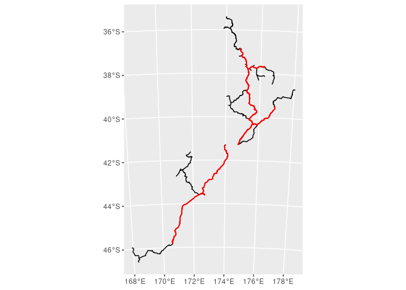
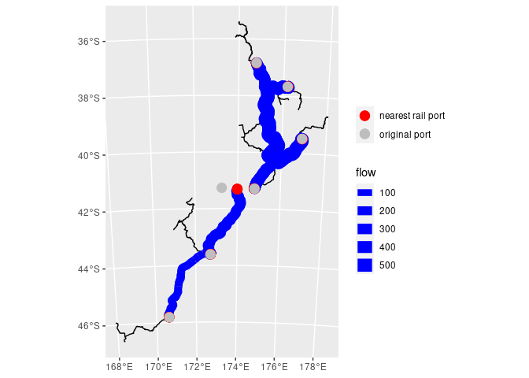

## Spatial networks: the power 
In [the previous post](https://shriv-portfolio.netlify.app/post/network-issues/), I blogged about the challenge of working with spatial networks. Once overcome, the power of spatial network analytics is easily accessed. In this post, I work through a common request in the transport sector: how do a set of origin destination flows aggregate on the transport infrastructure? A whole set of transport relevant policy questions around critical network points and resilience can follow flow calculations. 

The importance of loading flows on the network have already been acknowledged by Robin Lovelace and Mark Padgham in their packages `stplanr` and `dodgr`. The former was much more relevant to me but the network processing challenge (as highlighted in the previous post) was a key blocker. Now that the network connectivity has been temporarily addressed, I thought it would be an interesting exercise to see if the `sfnetworks` package itself allows for aggregation of routes into flows. 


## Set up
All code for this post can be found [on github](https://github.com/shriv/r-geospatial). Dataset and package dependencies are all included in the repository directly. The requirements are the same as [the previous post](https://shriv-portfolio.netlify.app/post/network-issues/). 


```r
# kiwirail data from 
# https://data-kiwirail.opendata.arcgis.com/datasets/13d266cb6dd141879daa76d993e2b0cc_0/data?geometry=103.420%2C-51.783%2C-116.834%2C-28.693

# Basic filter and transform of rail network from Kiwirail
# only keeping tracks
nz_rail <- st_read(here::here("data", "kiwirail.gdb")) %>%
  filter(!Type %in% c("Crossover", "Yard Track")) %>%
  st_transform(2193) %>% 
  st_cast("LINESTRING")

# nz port locations
port_locs <- read_csv(here::here("data",
                                 "port_locations.csv")) %>%
  st_as_sf(coords=c("lon", "lat"), crs=4326) %>%
  filter(country == "New Zealand") %>%
  filter(LOCODE %in% c("NZAKL", "NZTRG", "NZNPE", "NZWLG",
                       "NZNSN", "NZLYT", "NZPOE")) %>%
  st_transform(crs=2193)

# Convert to sfnetwork
# rounding coordinates to prevent precision errors
st_geometry(nz_rail) <- nz_rail %>% 
  st_geometry() %>% 
  map(~round(., -1)) %>% 
  st_sfc(crs = st_crs(nz_rail))

# subdividing edges where intersections happen at 
# internal points. excluding this creates a disconnected network
# because sfnetwork only connects edges where edges join at the 
# terminal nodes
railway_net <- nz_rail %>%
  as_sfnetwork(directed=F) %>% 
  convert(to_spatial_subdivision) %>% 
  convert(to_spatial_simple)

# Function for route calculation 
# returns a function that uses sfnetwork global variable
st_network_paths_mod <- function(from, to){
  return(try(st_network_paths(railway_net, from, to)))
}
```


## Create origin destination (OD) data
In this example, we don't have a pre-set OD matrix so we need to create our own. For some aspects of my work, I'm interested in freight flows between New Zealand ports so I have created a simple example of that use case. The steps to create an OD matrix are a simple extension of the previous post - the main differences being: 

(1) the `crossing` function to create all combinations of two vectors and, 
(2) a simple `rnorm` function to generate some fake flows per origin-destination combination. 


```r
# Isolate nodes as sf dataframe
nodes_rail <- railway_net %>% activate("nodes") %>% st_as_sf()

# Create origin destination (OD) for all port-port combinations
# Create dummy 'flow' values for every OD pair
orig_dest <- crossing(from = port_locs %>%
  st_set_geometry(NULL) %>% pull(LOCODE),
  to = port_locs %>%
    st_set_geometry(NULL) %>% pull(LOCODE)) %>%
  inner_join(port_locs %>% select(LOCODE), by = c("from"="LOCODE")) %>%
  rename(from_port = geometry) %>%
  inner_join(port_locs %>% select(LOCODE), by = c("to"="LOCODE")) %>%
  rename(to_port = geometry) %>%
  rowwise() %>%
  mutate(flow = (rnorm(1) * 100) %>% abs())  %>%
  mutate(to_index = st_nearest_feature(to_port, nodes_rail), 
         from_index = st_nearest_feature(from_port, nodes_rail),
         route = row_number())

# Find shortest path routes
routes_df <- orig_dest %>%
  mutate(path = pmap(list(from = from_index, to = to_index), .f=st_network_paths_mod)) %>% 
  unnest(cols=c(path))
```


## Visualise all routes
All the edges involved in a route are containerd in the `edge_paths` list. Once expanded out fully with `unnest`, we can join the edge geometries from the `sfnetworks` dataframe for a simple visualisation. From a cursory glance, it seems like all the routes that could be found have been. Many port-port combinations have no routes because they are on different islands. Terrestrial infrastructure networks in New Zealand have two components - one component for Te Ika a Maui (North Island) and another for Te Waipounamu (South Island). Noting, the existence of the two components because there is no land bridge connecting the islands. 


```r
# Unnest to get one row per edge
# Join on edge sf dataframe for geometry
port_port <- routes_df %>% 
  unnest(cols=c(edge_paths)) %>% 
  select(edge_paths) %>% 
  inner_join(railway_net %>% 
               activate("edges") %>% 
               st_as_sf() %>% 
               mutate(edge = row_number()), by = c("edge_paths" = "edge"))  %>% 
  st_as_sf()

# Visualise all routes
ggplot() + 
  geom_sf(data = railway_net %>% activate("edges") %>% st_as_sf()) + 
  geom_sf(data=port_port, colour="red") 
```

<!-- -->


## Aggregating flows
Since the routes dataframe can be unnested to give one edge per route per row, we can group by the edge and summarise the relevant property per edge. Since we're interested in all the flows passing through any given edge that is part of the port - port routes, we just add up all the flow values per origin - destination combination.


```r
# Group by every edge that has a route passing through
# Aggregate all routes  that pass through any given edge
# Aggregation by summing flow values
flows_df <- orig_dest %>%
  mutate(path = map2(.x = from_index, .y = to_index, .f=st_network_paths_mod)) %>% 
  unnest(cols=c(path)) %>% 
  unnest(cols = c(edge_paths)) %>% 
  group_by(edge_paths) %>% 
  summarise(flow = sum(flow))


# Visualise aggregated flows
ggplot() + 
  geom_sf(data = railway_net %>%
            activate("edges") %>% 
            st_as_sf()) + 
  geom_sf(data = railway_net %>% 
            activate("edges") %>%
            st_as_sf() %>% 
            mutate(row = row_number()) %>% 
            inner_join(flows_df, by = c("row" = "edge_paths")),
          aes(size=flow), 
          colour = "blue") + 
  geom_sf(data = railway_net %>% 
            activate("nodes") %>%
            st_as_sf() %>% 
            mutate(row = row_number()) %>% 
            inner_join(orig_dest, by = c("row" = "to_index")), 
          aes(colour = "red"),
          size = 4) + 
  geom_sf(data = orig_dest %>% select(from_port) %>% distinct() %>% st_as_sf(), 
          aes(colour = "grey"),
          size = 4) + 
  scale_colour_identity(breaks = c("red", "grey"),
                        labels = c("nearest rail port", "original port"),
                        guide = "legend", 
                        name = "")
```

<!-- -->

