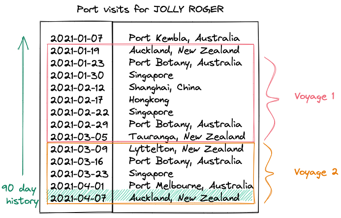
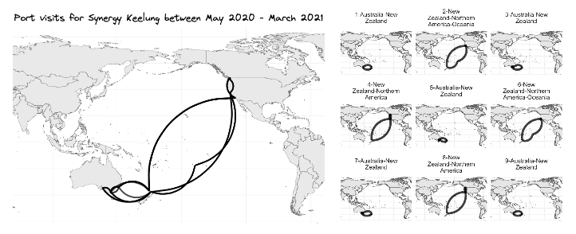

## Introduction
A single data source can provide myriad perspectives with judicious data enrichment and entity resolution. One of the datasets, I've been able to explore is cleaned ship movements (derived from AIS data) through an organisation subscription. The cleaned data provided was split into:

- Spatio-temporal point data of the movements - ship tracks
- Spatio-temporal point data of stops - port visits

While the bulk of the data cleaning work was already done by the provider, preparing the data for analysis that could connect to real-world issues still required some data wrangling. 

## Generalising concepts from commerical container shipping
Shipping lines manage container ships like buses but with greater tactical and strategic agility as they are highly competitive markets. Ships are associated with a *vessel fleet* that make *journeys* for a given *service*  to *pre-set schedules*. For example, a weekly ANL shipping line service ([KIX](https://www.anl.com.au/products-services/line-services/flyer/KIXANL)) connecting New Zealand, Australia and Southeastern Asia. 

- **Service**: an ordered set of port visits with an associated fleet that is marketed by a shipping line. In the example above, the KIX service between New Zealand, Australia and Southeastern Asia marketed by the shopping line, ANL. 
- **Journey**: a single rotation done by a ship in the service. 
- **Schedule**: frequency and duration of service. 

The details of commercial offerings from shipping lines cannot be connected with an independent data source like AIS. Instead, we define a series of data enrichments that are conceptually similar and keep a higher level that can generalise across all types of service offerings. 

- **Voyage**: an ordered set of international port visits made by a given ship that starts and ends in New Zealand. 
- **Route**: an ordered set of connected seaboards (sub-regions) based on the ports visited by the ship on a given voyage. 
- **Schedule**: a derived timetable for a ship built from the voyages and associated routes in a given period of time e.g. 2021. 

## Breaking journeys - from visits to voyages
The first step in data processing was to puncutate a mass of port visits made by a ship in some unit of time into a voyage. Fortunately, a simple algorithm can separate port visits into voyages for container ships since they run like buses to a fixed schedule. 

- Like buses, a particular ship can be pulled into another schedule. 
- Unlike bus routes, there can be minor changes to the set of visited ports across the year for the same schedule. 

The algorithm identifies a voyage as the sequence of international ports visited between the export and import ports in New Zealand on a single ship journey. Voyages exclude New Zealand ports visited by the ship for cabotage as the policy focus during the COVID-19 pandemic has been on international rather than domestic connectivity. 

- The *export port* is the last New Zealand port before the ship departs for an international port on its outward journey. 
- The *import port* is the first New Zealand port on the ship's inward journey. 

The algorithm extracts voyages for ships that make at least two separate journeys to New Zealand. A ship that makes a solitary journey to New Zealand from its typical service schedule elsewhere in the world will be not be included. These types of solitary voyages will need additional business logic to isolate the port visits into the ones relevant for the atypical voyage to New Zealand. 

Splitting a contiguous series of port visits into discrete voyages also offers the opportunity of classifying the voyage into a route based on the seaboards of the ports visited in the voyage. 

## Connecting seaboards with routes
We have definted routes as a higher order entity as they can aggregate across voyages in a way that mimics liner shipping services set up by shipping lines but with added benefit of being insensitive to specific commercial offerings. 

Every voyage can be classified as belonging to a route based on the (alphabetically ordered) set of unique visited regions. We use the region classification to approximate a seaboard [UN geoscheme](https://en.wikipedia.org/wiki/United_Nations_geoscheme) at the subregion level based on the country of the visited port. 

The exceptions of this classification are: 
- dis-aggregating Australia and New Zealand 
- aggregating Polynesia, Micronesia and Melanesia to Oceania.

The ordered set reduces the high variability in the order and number of visited ports across similar voyages. . For example, a ship that visits Auckland, Melbourne, Brisbane, Shanghai and Busan belongs to the `Australia-Eastern Asia-New Zealand` route. A ship that visits Tauranga, Sydney, Hong Kong, Ningbo and Tokyo will also be part of the same route `Australia-Eastern Asia-New Zealand`. 

