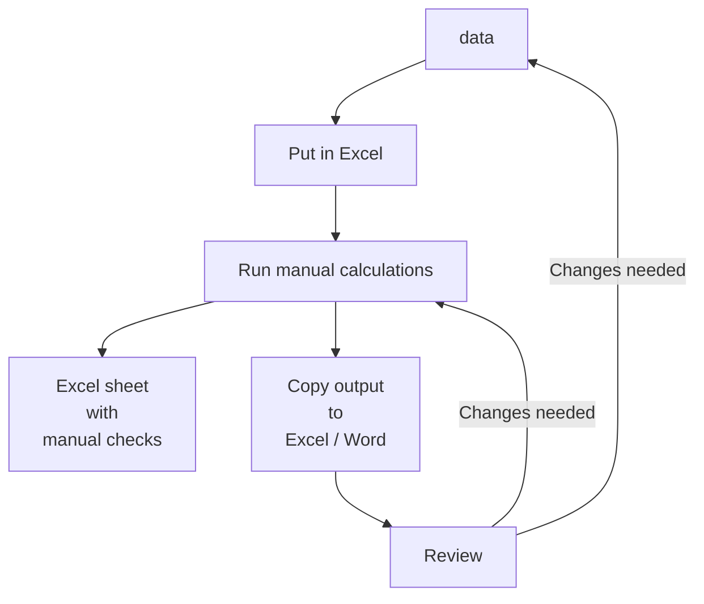
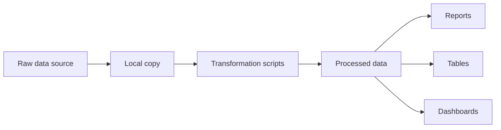
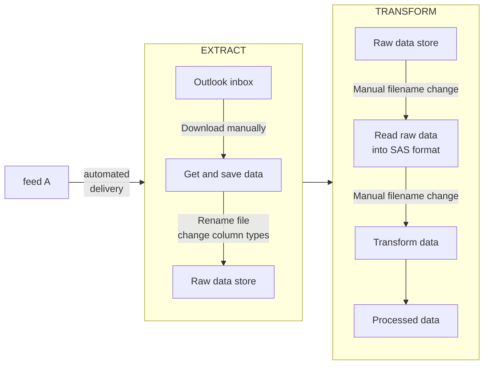
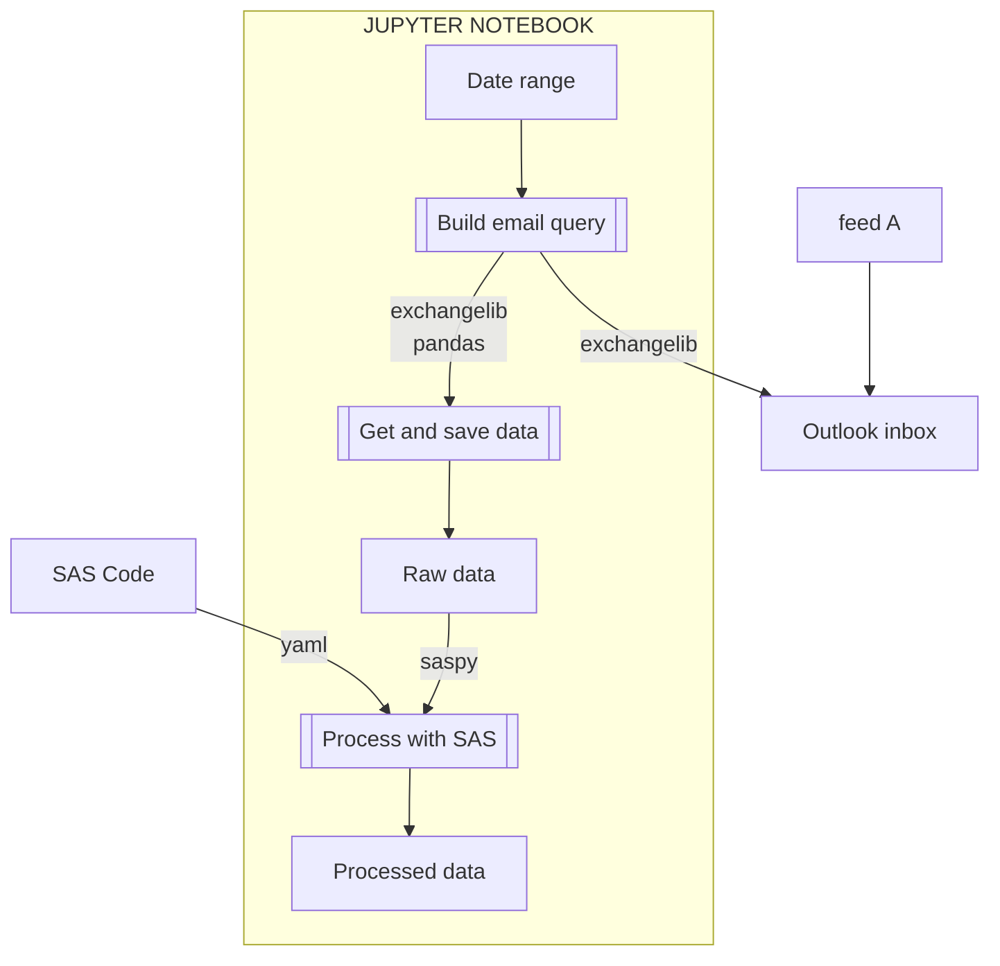
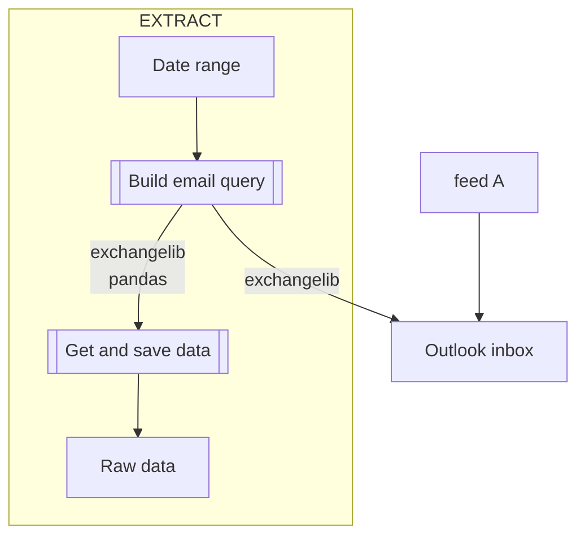
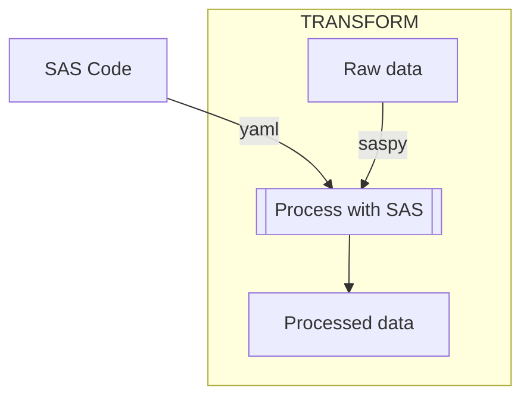

### the ubiquity of bad processes
Public sector, indeed even private sector, analytics are rife with silos and people-driven pipelines. Instead of building processes with minimal manual interference, pipelines are ususally a  mash of the metaphorical ductape and frenetic manual steps resulting in blood, sweat and tears for any analyst who subsequently picks up the work. 

Manual processes inherently need to be overseen and thus consume analyst headspace: to start, pause, stop, make changes, perform checks etc. Unfortunately, this headspace overload can have costly outcomes due to inevitable human error. Fortunately, most of these steps can be automated allowing the analyst to dedicate their skills to the gnarly checks or better yet, to using the data and providing business-relevant value. 

### rap as a paradigm
One nifty framework for moving from manual processes is RAPping i.e. building reproducible analytical pipelines. Coined by the UK Government Statistical Service, [RAP](https://gss.civilservice.gov.uk/reproducible-analytical-pipelines/) brings in concepts and practices from data engineering, devops and software carpentry domains to analysts in the public sector. 

> Reproducible Analytical Pipelines (RAPs) are automated statistical and analytical processes. They incorporate elements of software engineering best practice to ensure that the pipelines are reproducible, auditable, efficient, and high quality.

These practices include: 
- substituting manual steps with code 
- using modern, open source programming languages 
- converting raw data to statistical output into pipelines / workflows
- using version control to keep records of development
- bringing in code review practices

### rap to include data engineering
Despite its utility, RAP focuses primarily on converting data from a commonly-managed data store into analytical outputs (reports, tables, models etc). However, in the infrastructure-poor environments of public sector, data is often not in an accessible place with automated process to transform it in a form fit for subsequent RAPping. This means the concepts of RAP need to be brought further back into the data analysis process - into the 'data engineering domain'. 

### rapping with legacy code
For any analyst who has inherited a pre-existint data processing code base replete with manual management, it's not trivial to rewrite it with RAP principles. Certain complexities in the code are not trivial to move and, some data extraction steps are challenging. One example of a hard to move legacy code base has the following steps: 

### why python
Python is a modern, multi-paradigm, evolving, open source programming language. It is used widely across many domains - from web development to data science. Due to its breadth of use and popularity, there is an incredible ecosystem of packages. 

### python as glue
Manual steps like the following can all be done using Python. 
- changing file names in scripts to the latest data
- getting data deliveries from Outlook inboxes
- running scripts in order 

Python and its rich ecosystem of packages can eveb be used for complex pipelines that need to interface between different programs. Here, python libraries like `exhangelib` and `saspy` can connect to APIs and programs like Outlook and SAS respectively. 

### getting data with APIs
Application programming interfaces (APIs) allows applications to communicate with each other. The Outlook email program has a rich API behind it called Exchange Web Services (EWS). Applications (like our RAP extract data application) can send EWS queries to push or pull data to Outlook objects like emails, contacts and calendars. 

### running sas through python
It's worth noting that there are actually two ways or running SAS outside the SAS program: 
- With a SAS kernel in Jupyter*
- Through SASPy

> SASPy is a Python package that provides part of the underlying communication between Jupyter and SAS when using the SAS kernel; however, it can also be used directly (within Python code apart from the Jupyter environment, or within Jupyter notebooks that are written in Python), and has significant capabilities beyond the essential function of relaying SAS code and output.

> At its core, SASPy is capable of creating a SAS session and sending code to it for execution, as well as returning the output (logs and other output) to the controlling Python script. Yet it is also a powerful generator of SAS code, which means that it offers methods, objects, and syntax for use directly in idiomatic Python that it can then automatically convert to the appropriate SAS language statements for execution. In most cases, SAS procedures or steps are mapped directly to Python methods as a one-to-one equivalent.

[saspy is officially supported by SAS](https://support.sas.com/en/software/saspy.html) and, available as an [open source package](https://github.com/sassoftware/saspy). The library seems to be well-maintained and well-documented. 

### value of running sas through python
When the sas codebase is complex, large or both, it's convenient to instead just make it run easier. Furthermore, this approach allows to incremental refactoring - allowing hard-to-convert code to remain in SAS while moving easier code to Python. 

### breaking up sas code into yaml chunks
saspy is able to generate SAS queries from python commands. However, running existing SAS scripts with part of it needing amendment via pyton needs an extra step. The easiest solution so far has three main steps: 

- breaking up a SAS script into yaml chunks for "immutable" components
- "Mutable" components are created in python
- The immutable and mutable are brought together with Python's f-strings

### simple linear workflows with jupyter
> The Jupyter Notebook is an open-source web application that allows you to create and share documents that contain live code, equations, visualizations and narrative text. Uses include: data cleaning and transformation, numerical simulation, statistical modeling, data visualization, machine learning, and much more.

Jupyter notebook cells can be run in any order manually but using the 'Run All' command sets up a linear execution - cells run in series giving immediate linear dependency. This simple dependency management now turns any code / processing in the cells into a linear chain pipeline. 

### jupyter to bind, execute and document
Jupyter notebooks are not only a great way of coralling code into a pipeline. They also has additional features like:
- useful interface and IDE for development - especially with Jupyterlab
- documentation alongside code execution - easily updated while pipeline development is still in flux
- including outputting checks (as tables or graphs) as part of the pipeline making the executed notebook a log of the processing run and can be saved for posterity. 
- since checks are run automatically, python's `try execpt` can be used to raise errors and stop execution of the pipeline to give the analyst time to correct.
- executed outputs are stored in memory so with a sensible structure, it can be quite easy to re-run the notebook from an intermediate point rather than run the entire process again after correcting any issues. 
