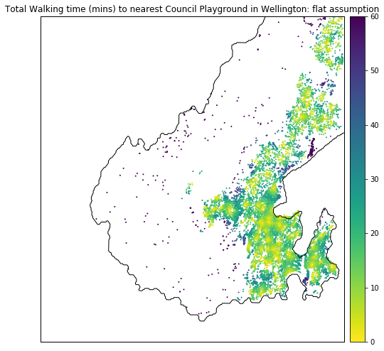
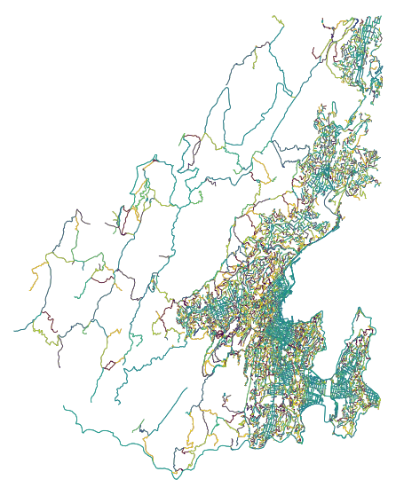
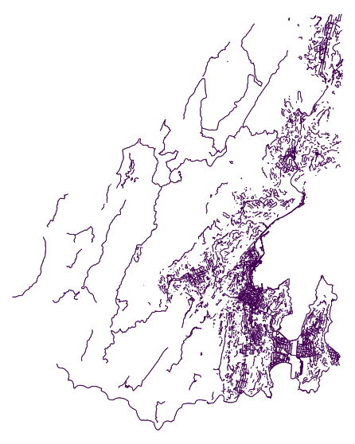
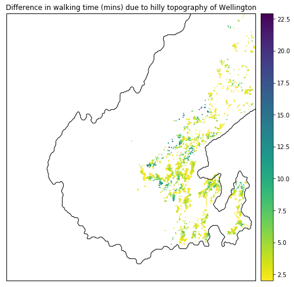

## Summary
Unlike cars, pedestrians are sensitive to their environment - from the weather to the terrain. Changes to either can impact the walking experience or the decision to walk. In this post, we explore the impact of hilly terrain on walkability. Specifically, on walkability to playgrounds - an amenity that is designed to be locally accessible on foot.

In Wellington, hills increase walking time to playgrounds by 9% on average. This post further shows how walkability can be analysed from two perspectives: (1) accessibility _from_ homes _to_ playgrounds or, (2) catchment areas of playgrounds. Depending on the goal of the analysis, the same underlying dataset can be used to produce either perspective.

Hills don't seem to impact average travel time much but we've used a highly idealistic walking speed to a playground! Furthermore, the distribution of accessibility is highly skewed. The average is not a representative metric. Even under the 'flat land' assumption, total travel times can be higher than 40 minutes.

## Introduction
Playgrounds are important local amenities that are designed with pedestrian access in mind. Hence, accessibility to playgrounds can act as a proxy for measuring _walkability_ of a city. Good design of local amenities should manage the various factors that might prohibit walking. For example, difficult terrain, population density induced crowding etc. In this post, we'll be examining the following question in detail.

> _How prohibitive is Wellington’s topography on pedestrian accessibility to playgrounds?_

In a [previous post](https://shriv.github.io/Playgrounds-vs-pubs/), accessibility was calculated in units of distance. Distance is an excellent metric for driving or walking on flat land. For short travels by car or walking on flat land, distance can be directly converted to travel time - since most people have an intuitive understanding of their average driving speeds (50 km/h for residential roads in New Zealand), or their approximate walking speed on flat land (usually around 5 km / h for a fit adult as given in [Section 3.4 in NZTA pedestrian planning and design guide](https://www.nzta.govt.nz/assets/resources/pedestrian-planning-guide/docs/pedestrian-planning-guide.pdf)). Hills are not an issue for drivers provided road quality and safety are no different to flat land. But hills do impact travel time for pedestrians; which in turn impacts accessibility.

## Technical overview
This post is quite heavy on technical detail - accessibility analysis that includes the impact of street gradients on travel speed isn't an _out of the box_ analysis. So, this post is much more of a _methodology_ post with some (hopefully, interesting and useful) insights along the way.

Key technical challenges that needed to be overcome are listed and referenced below. Some are covered in this post, others are only available in the companion [Jupyter Notebook](https://github.com/shriv/accessibility-series/blob/master/Accounting%20for%20hills%20in%20accessibility%20analyses.ipynb)

| Issue | Covered in |
|:---:|:---|
| [Converting accessibility metric from distance to travel time](#wellington-street-network-without-elevation)| Blog Post|
|[Getting street gradients from elevation data](#wellington-street-network-with-elevation) | Blog Post|
|[Adjusting travel time according to street gradients](#converting-incline-distance-to-travel-time) | Blog Post|
|Filtering street gradient networks | [Jupyter Notebook](https://github.com/shriv/accessibility-series/blob/master/Accounting%20for%20hills%20in%20accessibility%20analyses.ipynb)|
|Creating _pandana_ network from _osmnx_ graph with street gradients| [Jupyter Notebook](https://github.com/shriv/accessibility-series/blob/master/Accounting%20for%20hills%20in%20accessibility%20analyses.ipynb)|
|Adding colourbars to _osmnx_ isochrone plots | [Jupyter Notebook](https://github.com/shriv/accessibility-series/blob/master/Accounting%20for%20hills%20in%20accessibility%20analyses.ipynb)|
|Calculating route statistics with _osmnx_ and _pandana_ | [Jupyter Notebook](https://github.com/shriv/accessibility-series/blob/master/Accounting%20for%20hills%20in%20accessibility%20analyses.ipynb)|


## Data munging
All the technical challenges identified above involve data munging. The relief is that we'll only be working with two datasets, and most of the munging is done with the street network.

- [*WCC playground locations*](https://data-wcc.opendata.arcgis.com/datasets/c3b0ae6ee9d44a7786b0990e6ea39e5d_0?geometry=174.749%2C-41.324%2C174.881%2C-41.302&page=2): downloaded as a zip file
- *Wellington street network*
    - without elevation: using OpenStreetMap via *pandana*
    - with elevation: using OpenStreetMap and Google Elevation API via *osmnx*


### WCC Playgrounds
The WCC playground data is easy to consume as it's just a set of geolocations. The form is appropriate for accessibility analysis too since _Points of Interest_ (POIs) are always single, representative coordinates (rather than polygons).

<div class="iframe_container">
<iframe src="map_playgrounds.html"
style="width: 100%; height: 450px;"></iframe>
</div>

### Wellington street network: without elevation
Getting the Wellington street network in a form suitable for accessibility analysis is trivial. The previous posts [on fuel station](https://shriv.github.io/Fuel-Stations-Analysis-Part-3/) and [playground](https://shriv.github.io/Playgrounds-vs-pubs/) accessibility cover the process in detail. Without delving into the specifics, the process simply calls _pandana's_ OpenStreetMap loader.

#### Changing accessibility units
The default _pandana_ network has edge weights in metres, which means that the accessibility analyses will also be in metres. We can post-hoc convert distance to travel time with an average walking speed of 5 km/h or, 83 m/minute if we want travel time in minutes.

|Accessibility as distance | Accessibility as travel time |
|:---:|:---:|
|||

The accessibility data can be extracted and plotted as a histogram. Here, we see that the average distance to a playground is 700 m, or an 8 minute walk.

| Distance distribution | Time distribution |
|:---:|:---:|
|| |

### Wellington street network: with elevation
 Both the nodes and edges of the street network can be enriched with elevation data retrieved from Google Elevation API. Nodes have a single value for elevation. Elevation at the connecting nodes of an edge can be used to derive the _inclination_ / _gradient_.

The above steps have been simplified to terse one-liners by the excellent Python package, _osmnx_, as shown in the code block below. They require [signing up to the Google Elevation API](https://developers.google.com/maps/documentation/elevation/start) and getting an API key.

Most of the code is copied from [Geoff Boeing's tutorial](https://geoffboeing.com/2017/05/osmnx-street-network-elevation/). The key difference is that I've stored the API key in a YAML file. By the end of the code block, we have an _osmnx_ graph with street gradients for every edge in the network.

```python
# Open the API keys stored in a YAML file
with open("utils/api_keys.yaml", 'r') as stream:
    data_loaded = yaml.load(stream)
# Get Google Elevation API key
google_elevation_api_key = data_loaded['google_elevation_api_key'][0]
# Create an OSMNX walking street network for the Wellington bounding box
G = ox.graph_from_bbox(north, south, east, west, network_type='walk')
# Add elevation values for the nodes in the OSMNX graph
G = ox.add_node_elevations(G, api_key=google_elevation_api_key)
# Generate an edge grade (inclination) with the elevations at the nodes
G = ox.add_edge_grades(G)
```

#### Wellington street elevation profile
_osmnx_ generates an edge weight based on connecting node elevation values. We can extract and plot the edge gradients without and with a filter on values.

| All street gradients | "Flat" regions (within 5% gradient) |
| :---: | :---:|
||  |

The graphs show that Wellington is largely flat around the coastline but is surrounded by hills. Larger suburbs like Karori and Johnsonville have been built on elevated plateaus.

#### Dealing with MultiDiGraph
_Osmnx_ enriches the street network with elevation and gradients using Networkx's _Multidigraph_ structure. In this structure, the edge _(u,v)_ is also present as _(v,u)_ with the _opposite_ gradient. The duplication is why the average elevation profile is 0 and symmetric!


Since accessibility analysis doesn't prescribe a starting point, we have to take both _to_ and _from_ journeys to fully quantify the impact of hills on travel time. To do this, we need to (1) split the components of the graph, (2) calculate accessibility for each component and, (3) sum the components as _total travel time_.

The street network can be easily split to only give unique _(u,v)_ in one graph and the inverse, _(v,u)_, in another. Accessibility analysis is performed for _each_ network and the values summed together to give the _total accessibility_.

|graph|geometry|grade|length|name|u|v|
|:---:|:---: |:---: |:---: |:---: |:---: |:---: |
|Undirected (u,v)|LINESTRING (174.7934694 -41.2275193, 174.79300...|0.1319|66.800|Truscott Avenue|1259077823|1259072929|
|Undirected (u,v)|LINESTRING (174.7921165 -41.2280406, 174.79263...|-0.0475|65.443|Truscott Avenue|1259077823|1259072943|
|Undirected inverse (v,u)|LINESTRING (174.7934694 -41.2275193, 174.79300...|-0.1319|66.800|Truscott Avenue|1259072929|1259077823|
|Undirected inverse (v,u)|LINESTRING (174.7921165 -41.2280406, 174.79263...|0.0475|65.443|Truscott Avenue|1259072943|1259077823|


#### Converting incline distance to travel time

A [simple search](https://books.google.co.nz/books?id=SyulBQAAQBAJ&pg=PA160&lpg=PA160&dq=walking+speed+gradient+accessibility&source=bl&ots=iKmtg73TIV&sig=ACfU3U3N5CAAtqoA0QzfSpJubylfjneWtA&hl=en&sa=X&ved=2ahUKEwiqqeKj3YTgAhVQXn0KHdSFDWsQ6AEwAHoECAkQAQ#v=onepage&q=walking%20speed%20gradient%20accessibility&f=false) led me to [Naismith's Rule](https://en.wikipedia.org/wiki/Naismith%27s_rule) and then to [Tobler's Hiking Function](https://en.wikipedia.org/wiki/Tobler%27s_hiking_function) to calculate travel time as a function of distance and gradient.

I've chosen to go with Tobler's without much rationale other than its simple form. Tobler's hiking function for speed, $\nu$, is a shifted exponential with three parameters: $a$, $b$ and $c$ which give the fastest speed, speed retardation due to gradient and shift from zero respectively.

$$
\nu = a\exp^{\left(-b.|slope~+~c|\right)}
$$

Note that $slope$ in the equation is a dimensionless quantity: $\frac{dh}{dx}$ (or, rise / run). Terminology-wise, $slope$, is equivalent to _gradient_ and _inclination_. Tobler's function can also be written with slope in _degrees_ ($^{\circ}$). Similarly, speed is given in in _km/h_ and can be converted to a travel time in minutes with a multiplicative factor, (60/1000). Both time and speed versions of Tobler's function are shown in the graph below.

| | a | b | c
:---: | :---: | :---: | :---:
_Physical meaning_ | Fastest speed | Speed change due to gradient | Gradient of fastest speed |
_Mathematical representation_ | $\nu_{max}$ | ($\frac{\Delta\nu}{\Delta ~gradient}$) | $gradient\|\nu_{max}$
Tobler | 6 | 3.5 | 0.05
Brunsdon | 3.557 | 2.03 | 0.133

While I haven't read Tobler's original paper, a [brief exposition of other equivalent functional forms to Tobler's](https://rpubs.com/chrisbrunsdon/hiking) has been written up by Chris Brunsdon. Brunsdon's analysis shows a  different relationship to Tobler's - likely because the underlying data is different.


 For a more rigorous analysis of pedestrian accessibility, we'd refit the functional form above (or similar) as Brunsdon does for different types of pedestrians. According to NZTA and various other studies, there is significant heterogeneity in walking speed; both from the route (terrain, incline etc) and also the characteristics of the walker e.g. carrying things, footwear, and demographics. Anecdotally, we know that a commuter will walk at a very different speed to a father taking his children to the playground during the daytime.


## Accessibility analysis for hilly Wellington
With a network of street gradients converted to travel time, we can now compare the impact of hills on accessibility. In the [companion Jupyter notebook](https://github.com/shriv/accessibility-series/blob/master/Accounting%20for%20hills%20in%20accessibility%20analyses.ipynb), there are a couple of additional, technical steps:
- Creating a _pandana_ network from an _osmnx_ graph with travel time calculated according to the street gradient.
- Calculating overall accessibility as _total_ travel time. In the notebook this is done by calculating accessibility separately for _(u,v)_ and _(v,u)_ networks and summing the values.

### Hills vs. Flat
The main accessibility heatmap for hilly Wellington, seen below, doesn't look too different to the flat land assumption.

| Flat land assumption | Accounting for Hills |
|:---: |:---: |
|||

We only see the impact of the hills when we consider a differential heatmap. Anyone familiar with the topography of Wellington will immediately note that areas around the slopes of the Town Belt and the Western Hills are affected.  


| Difference | Difference > 2 minutes |
|:---: |:---:|
| | |

### Impact of hills on travel time
It's worth noting that while accessibility to playgrounds is worse due to hills, the total travel time in hilly areas only increases by 9% on average. Hilly nodes have an absolute average nearby gradient of more 5%. Sample code to calculate the average street gradient of a node is given below.

```python
# Extract an undirected graph from an elevation MultiDiGraph
G_undir = G.to_undirected()
nodes_gdfs, edges_gdfs = ox.graph_to_gdfs(G_undir)
# Get local average gradient by node  
u_grades = (edges_gdfs
           .groupby('u')
           .agg({'abs_grade': 'mean'})
           .reset_index()
           .rename({'u': 'id'}, axis=1))
# Repeat for v
...
# Join u_grades and v_grades and drop duplicates
...
```

| Hilly Nodes | Flat Nodes |
|:---: |:---:|
||


### Nearby options?
The impact of Wellington's topography is also seen in the availability of council playground options. In a future post, it would be interesting to see the choices available per capita - since flatter suburbs are also more likely to have higher population density.


| Nearest playground | Second nearest playground|
|:---: |:---:|
|||

## Validating the accessibility analysis
We've see how Wellington's topography affects travel times to playgrounds. A quick validation of the approach can be done with Google Maps. A more complex validation can be done Graphhopper.  

We'll be validating the route from 110 John Sims Drive to Kipling Street Play Area. I chose this particular example because of the monotonicity in gradient for the to and from journeys. Going to the park is consistently downhill and coming back is consistently uphill. None of the classic Wellington roller-coaster routes here!

The route used to calculate the accessibility in _pandana_ can be visualised by extracting the nearest graph nodes to the origin and destination and using the Networkx get_shortest_path method.

With a little additional poking about the graph edges, we can extract the summary, in distance and time, for this route. The code for this is available in the Jupyter Notebook.

> Route is  925 m long and takes 24.3 mins


A more detailed analysis of the route gives:

> 110 John Sims Drive to Kipling Street Play Area: Street distance is  925 m. At 5km/hr, it takes 11.1 mins. Going to the park (downhill) takes 11.9 mins. Coming back from the park (uphill) takes 12.3 mins'

### With Google Maps
[110 John Sims Drive](https://www.openstreetmap.org/node/6083853567) to Kipling St Play Area in Johnsonville.
- [Uphill from the park](https://www.google.co.nz/maps/dir/Kipling+Street+Play+Area,+Johnsonville,+Wellington/110+John+Sims+Dr,+Johnsonville,+Wellington+6037/@-41.2287819,174.7921861,15.94z/data=!4m14!4m13!1m5!1m1!1s0x6d38adc0eacfab81:0xb46b5857955895d8!2m2!1d174.797878!2d-41.2251416!1m5!1m1!1s0x6d38ade99a925aa1:0x68fba1d12c2d8b01!2m2!1d174.7921832!2d-41.229301!3e2): 14 minutes
- [Downhill to the park](https://www.google.co.nz/maps/dir/110+John+Sims+Dr,+Johnsonville,+Wellington+6037/Kipling+Street+Play+Area,+Johnsonville,+Wellington/@-41.2287819,174.7921861,15.94z/data=!3m1!4b1!4m14!4m13!1m5!1m1!1s0x6d38ade99a925aa1:0x68fba1d12c2d8b01!2m2!1d174.7921832!2d-41.229301!1m5!1m1!1s0x6d38adc0eacfab81:0xb46b5857955895d8!2m2!1d174.797878!2d-41.2251416!3e2): 11 minutes


We don't expect the OSM street data to differ much from Google (at least for a city!) and the elevation data should be identical. The key difference is likely the distance to time conversion. For this validation, we have over-estimated the downhill time and under-estimated the uphill time.

obler's time conversion is definitely an ambitious target - especially for families walking with young children. For a more accurate analysis, we'd need recommendations of a more sensible top speed and hill climbing speed retardation from Urban Planners.


### With Graphhopper Routing API
Graphhopper is a powerful engine with a fantastic routing API. It's easy to [register for a free licence](https://www.graphhopper.com/pricing/) and get an API key. Since I'm only using the API for validation, I can stay well within the free limit.

Results from the API request can be visualised both on Graphhopper Maps and OpenStreetMap directions.

- Downhill route visualised [here](https://www.openstreetmap.org/directions?engine=graphhopper_foot&route=-41.2292%2C174.7922%3B-41.2253%2C174.7976#map=17/-41.22708/174.79538) and [here](https://graphhopper.com/maps/?point=-41.2292%2C174.79216&point=-41.22527%2C174.79759&locale=en-us&vehicle=foot&weighting=fastest&elevation=true&use_miles=false&layer=Omniscale)

- Uphill route visualised [here](https://www.openstreetmap.org/directions?engine=graphhopper_foot&route=-41.22527%2C174.79759%3B-41.22920%2C174.79216) and [here](https://graphhopper.com/maps/?point=-41.22527%2C174.79759&point=-41.2292%2C174.79216&locale=en-us&vehicle=foot&weighting=fastest&elevation=true&use_miles=false&layer=Omniscale)

Crafting the API request is quite simple - the request parameters are detailed [here](https://github.com/graphhopper/graphhopper/blob/0.11/docs/web/api-doc.md). The resultant JSON can be parsed and used for further analysis.

I haven't quite figured out how to ingest this stream of rich data for further analysis. In theory, I'd like to be able to validate the speeds and times of segments in the route against the _pandana_ + _osmnx_ extract. Perhaps even reverse engineer the gradient to speed conversion.

```python
graph_hopper_api_key = data_loaded['graph_hopper_api_key'][0]
graph_hopper_query = "https://graphhopper.com/api/1/route?point=-41.2292,174.7922&point=-41.2253,174.7976&vehicle=foot&points_encoded=false&locale=nz&key=" + graph_hopper_api_key
```

```bash
%%bash -s "$graph_hopper_query"
curl $1
```

```json
{"hints":{"visited_nodes.average":"28.0","visited_nodes.sum":"28"},"info":{"copyrights":["GraphHopper","OpenStreetMap contributors"],"took":4},"paths":[{"distance":1007.3,"weight":603.101372,"time":725253,"transfers":0,"points_encoded":false,"bbox":[174.792028,-41.229148,174.798734,-41.22499],"points":{"type":"LineString","coordinates":[[174.792028,-41.229148],[174.792089,-41.229032],[174.792403,-41.228742],[174.792854,-41.228362],[174.792949,-41.228113],[174.792882,-41.22792],[174.793009,-41.227871],[174.793469,-41.227519],[174.79382,-41.227449],[174.79396,-41.227773],[174.794037,-41.227829],[174.794583,-41.228031],[174.795135,-41.228387],[174.79614,-41.227492],[174.797424,-41.226418],[174.797595,-41.226301],[174.79831,-41.225888],[174.79852,-41.22564],[174.798734,-41.225427],[174.798559,-41.225274],[174.798037,-41.225018],[174.797925,-41.22499],[174.797878,-41.224999],[174.797832,-41.225054],[174.797679,-41.225337],[174.797637,-41.225354]]},"instructions":[{"distance":163.218,"heading":21.8,"sign":0,"interval":[0,5],"text":"Continue onto John Sims Drive","time":117517,"street_name":"John Sims Drive"},{"distance":68.299,"sign":2,"interval":[5,7],"text":"Turn right onto Truscott Avenue","time":49175,"street_name":"Truscott Avenue"},{"distance":31.971,"sign":1,"interval":[7,8],"text":"Turn slight right onto Truscott Avenue","time":23019,"street_name":"Truscott Avenue"},{"distance":161.515,"sign":2,"interval":[8,12],"text":"Turn right onto Elliott Street","time":116290,"street_name":"Elliott Street"},{"distance":448.627,"sign":-2,"interval":[12,18],"text":"Turn left onto Kipling Street","time":323010,"street_name":"Kipling Street"},{"distance":133.67,"sign":-2,"interval":[18,25],"text":"Turn left","time":96242,"street_name":""},{"distance":0.0,"sign":4,"last_heading":242.3439586064843,"interval":[25,25],"text":"Arrive at destination","time":0,"street_name":""}],"legs":[],"details":{},"ascend":12.986007690429688,"descend":66.6875,"snapped_waypoints":{"type":"LineString","coordinates":[[174.792028,-41.229148],[174.797637,-41.225354]]}}]}
```

## Inverting accessibility to isochrones
Our perspective so far has been the access _from_ any street location _to_ the nearest park. We can flip this perspective and consider the nearest street locations _from_ the park. This perspective is the basis of _isochrones_.

Like the accessibility analysis, we can choose the relevant units to visualise as isochrones. I've kept the _total_ travel time units in this example.

The street networks below show the 0-25 minute isochrones in increments of 5 minutes. The isochrones can be visualised as convex hull polygons, or filled street skeleton isochrones. The latter visualisation has been adapted from [this excellent post](http://kuanbutts.com/2017/12/16/osmnx-isochrones/). The filled street skeletons offer a more realistic visualisation - especially in areas containing street networks with low connectivity like the following example.

The points used in the validation section are repeated here. The blue and green points represent 110 John Sims Drive and the Kipling St Play Area respectively.


| Catchment polygons | Catchment along streets|
|:---:|:---:|
|  | |

The isochrones are centered on the closest street node to the park. The address we're considering is in the 20-25 minute isochrone. This corresponds well to the total time of 25 minutes calculated in the previous section (11 minutes downhill and 14 minutes uphill).

The isochrones visualisation is useful but we're limited to considering a small set of parks at a time. A more insightful analysis could be to look at residential areas that fall within the catchment zones of multiple playgrounds.

## Conclusions
The average impact of hilly terrain on playground accessibility seems to be low - only a 9% increase in total travel time. However, the average is a poor representation since the distribution of travel time is highly skewed. Even under the _flat land_ assumption, total travel times can be higher than 40 minutes.

In the following post, we will compare accessibility across different residential regions of Wellington, with the aim of identifying areas with poor access.
