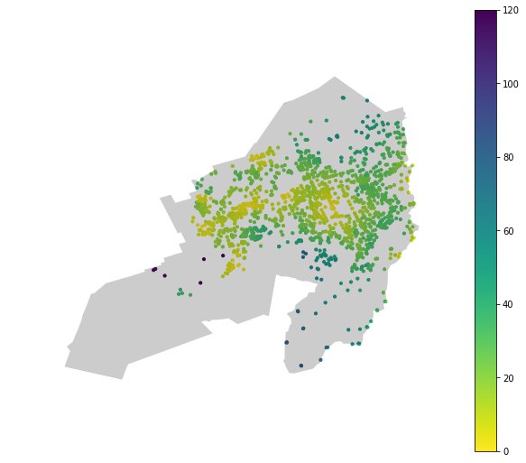
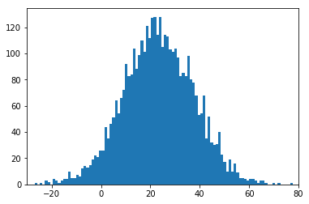
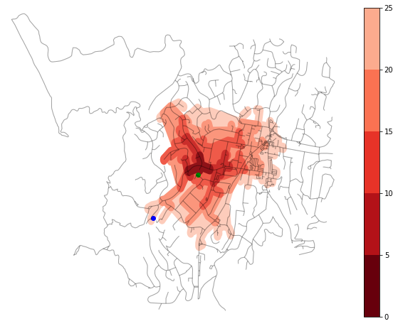

## Introduction
Before diving into the nitty gritty of modelling accessibility across the different suburbs, it's worth taking a high-level persepective into _why_ modelling is useful. I hope to make the case that approximating reality with models allows us to dredge up some useful insights.

In this post, we will look at:
- The accessibility characteristics of a suburb
- Suburban characteristics don't fit our model approximations. And how we can update our model to better reflect reality.


### The goal of statistical modelling
The best reason for trying our hand at statistical modelling comes from the entertaining and brilliant pedagogue: [Ben Lambert](https://ben-lambert.com/about/).

> In life, noise obfuscates signal. What we see often appears as an incoherent mess that lacks any appearance of logic.

> Statistical inference is the logical framework we can use to trial our beliefs about the noisy world against _data_. We formalise our beliefs in models of _probability_.

<p style='font-size: 90%; text-align: right; font-style:italic;'>
  - A Student's Guide to Bayesian Statistics, Ben Lambert (p 17)
</p>
<br>

In his book, Lambert goes on to elaborate the gains acheived from employing a Bayesian approach to statistical inference. Our analysis into accessibility by suburb doesn't explicitly benefit from a Bayesian approach but I've chosen to use it anayway since I'm now completely avowed to _The Bayesian Way_ (_Bayes-do_?).


### Models as an approximation of reality
The core component of statistical inference is a _statistical model_ - often shortened to just _model_. Common models formalise the data generation process by quantifying the relationhip between inputs and outcomes. For example, linear regression models quanitfy the relationship between a set of user-defined inputs and the possible outcomes given those inputs.

The model we're using in this post is much simpler: we're considering the probability space of the outcomes - with a particular interest in summary statistics like the mean, $\mu$, and standard deviation, $\sigma$. As we'll [see later on](#truncated-normal-model-for-better-fit), we choose a particular mathematical form to represent the probability space of average ($\mu$) and heterogeneity ($\sigma$) of accessibility within a suburb.

### Model with care
It's worth noting that not all data-driven questions benefit from statistical modelling. Models can be complicated and difficult to explain to others - even technically-oriented peers. In view of this, some data evangelists advocate a simpler analysis process. Kat Greenbrook highlights how the [modelling aspect can be left out for many business analytics questions](https://www.linkedin.com/pulse/data-stories-glue-analytics-cycle-kat-greenbrook/).

| Data Science cycle | Data Analysis cycle | "Modelling Silo" |
| :----------------: | :-----------------: | :-------------: |
|   |   |
| Actions from model output / insights  | Actions directly from exploratory analysis | Pointless modelling. No pertinent question and no actions |

<p style='font-size: 90%; text-align: right; font-style:italic;'>
  - Images &copy; <a href="https://www.linkedin.com/pulse/data-stories-glue-analytics-cycle-kat-greenbrook/">Kat Greenbrook</a>
</p>
<br>

Data anlysis alone is powerful; exploratory analyses unearth useful insights that can be followed through with business actions. As people who harness data for a purpose, we must constantly evaluate whether the extra complexity of the model layer is adding significant utility and insight.

> Modelling should never be undertaken if there is not a clear use case for the output.

<p style='font-size: 90%; text-align: right; font-style:italic;'>
  - <a href="https://www.linkedin.com/pulse/data-stories-glue-analytics-cycle-kat-greenbrook/">Kat Greenbrook</a>
</p>
<br>

As someone who has frequently lunged into modelling without a cause, I can attest to the pervasive culture of the 'Modelling Silo' in Data Science. This 'cycle' is wholly disconnected to pertinent questions and, any useful actionable output.

### Model for a reason
Now that we have been cautioned to think before we model, we can identify how models can help better understand playground accessibility in Wellington.

In the [previous post](https://shriv.github.io/Impact-of-hills-on-walking-to-playgrounds-in-Wellington/), we ended with heatmaps of accessibility - defined as total travel time. The heatmaps conveyed a holistic picture of areas with worse accessibility due to the hilly topography. However, we couldn't pick out any details from the overview. For example, we might care about how our specific neighbourhood compares to another, or our neighbourhood vs. the average for the city.

Comparisons can be done with single point values alone. But, robust comparisons rely on statistical inference - the most classic being the [_t-test for comparing two means_](https://en.wikipedia.org/wiki/Student%27s_t-test). In a [following section](#results-for-mu-and-sigma), we will see how we can robustly compare suburbs using a _Bayesian_ statistical model.


### Models for decision making
Adding a model for comparing suburbs has further utility - it can be used for explicit or qualitative decision making. Explicit decisions are appropriate in a business context since executives want to [tl;dr](https://www.urbandictionary.com/define.php?term=TLDR) the best option. Since this series is more focused on exploration, we'll be building a qualitative picture guided by metrics and analyses.

> Can we summarise the playground accessibility characteristic for a given suburb?

This question can help understand how "family-friendly" a particular suburb is. Young families could compare the suburb accessibility characteristics to help make the decision for a move or, evaluate whether the suburb is right for their lifestyle.

From this question and potential use, we can desgin the model and outputs for an intuitive comparative analysis. The final model allows for two levels of qualitiative comparison: (1) comparing a single suburb to the city average or, (2) comparing any two suburbs together.

### Models to support domain understanding
Since models approximate reality, the difference between the model and reality can also add valuable insight.

> Which suburbs don't follow the approximation set by the model? Can we use our domain knowledge to understand why?

In this scenario, mismatch between the data ('reality') and the model can help us understand the nature of suburbs better; and use this understanding to update our model for a better representation of reality.

## Technical details

| Technical challenge | Covered in |
| :-----------------: | :--------: |
| Geoprocessing to get accessibility within a suburb| [Jupyter Notebook](https://github.com/shriv/accessibility-series/blob/master/Visualising%20accessibility%20by%20suburb.ipynb) |
| Extracting accessibility distributions by suburb| [Blog Post](#visualising-accessibility-within-suburb-boundaries) |
| Build a Bayesian model for an individual suburb | [Blog Post](#bayesian-modelling-of-accessibility) |
| Model average ($\mu$) and heterogeneity ($\sigma$) on two levels: (1) per suburb and, (2) across all suburbs | [Blog Post](#hierarchical-modelling) |
| Stan models for Bayesian analysis| [Code files](https://github.com/shriv/accessibility-series/tree/master/stan) |
| Use average and heterogeneity, relative to Wellington average, to classify accessibility characteristic for a given suburb | [Blog Post](#quadrant-visualisation) |


### Datasets

| Dataset | Format | Link |
| :-----: | :----: | :--: |
| WCC playground locations  | .zip| [Wellington City Council](https://data-wcc.opendata.arcgis.com/datasets/c3b0ae6ee9d44a7786b0990e6ea39e5d_0)|
| WCC suburb boundaries  | .gdb | [Wellington City Council](https://data-wcc.opendata.arcgis.com/datasets/f534738cf3e648f7b1524a9697376764_0) |
|StatsNZ Area Unit boundaries   | .gdb  | [StatsNZ](https://datafinder.stats.govt.nz/layer/25743-area-unit-2013/)  |
| StatsNZ 2019 meshblock boundaries | .gdb | [Stats NZ](https://datafinder.stats.govt.nz/layer/98971-meshblock-higher-geographies-2019-generalised/data/) |
|LINZ residential polygons   | .gdb  | [LINZ](https://data.linz.govt.nz/layer/50325-nz-residential-area-polygons-topo-150k/)  |
| Wellington street network without elevation | - | OpenStreetMap via osmnx |
| Wellington street network with elevation | - | OpenStreetMap + Google Elevation API via osmnx|


## Accessibility by Wellington suburb
In all the previous posts (and series), we've only looked at accessibility for all of Wellington. Here, we show that the accessibility data can be filtered by the spatial boundary of choice. This is done by some clever geoprocessing enabled by _geopandas_.

The steps are pretty simple:
- Extract node coordinates and accessibility from pandana network
- Convert node coordinates to a geoseries
- Tag nodes within a suburb boundary using the _contain_ operation.

```python
# Extract node coordinates and accessibility from pandana network
orig_nodes = network_hills.nodes_df
df_joined = pd.merge(orig_nodes.reset_index(),
                     total_hills_1.reset_index(),
                     how='inner')
df_joined.columns = ['node_id', 'lon', 'lat', 'accessibility']

# Convert lat and lon to geoseries
df_joined_coords = dp.coords_df_to_geopandas_points(df_joined,
                                                    crs={'init': 'epsg:4167'})

# Get suburb values for accessibility data
playground_df = geopandas.sjoin(wcc_suburbs,
                                df_joined_coords,
                                op='contains').drop('index_right', axis=1)
```

### Visualising accessibility within suburb boundaries
With a dataframe containing both the accessibility information and the suburb, we can filter and plot the accessibility for specific suburbs. We only need the accessibility data for the suburb and the boundary information to overlay the two datasets.

```python
karori_accessibility = playground_df[playground_df['suburb'] == 'Karori']
karori_boundary = wcc_suburbs[wcc_suburbs['suburb'] == 'Karori']
```




### Extracting accessibility distributions by suburb
The same filters used to plot the accessibility heatmap within a suburb can be used to extract the accessibility values alone without any spatial information. This raw accessibility data is the basis for our statistical model.


## Modelling of accessibility in a single suburb
Once we have the accessibility values by suburb, we can start thinking of how we might model them. From the previous figure, the suburban accessibility distributions have some distinctive features:
- Values are all positive
- Some are heaviliy skewed
- Most have single mode
- Some look like a normal distribution

```python
uni_norm_model = su.load_or_generate_stan_model('stan', 'univariate_normal')
lower_trunc_norm_model = su.load_or_generate_stan_model('stan', 'lower_truncated_univariate_normal')
```

### Normal Model
Given the unimodel nature of the majority of the accessibility distributions, a normal model is a trivial starting point. We won't go into the details here but we can easily write a Stan model to compute the $\mu$ and $\sigma$ values of a univariate normal distribution. Results from a Stan fit are given below. I've also computed the posterior predictive - the 'y_pred' variable.

```
Inference for Stan model: anon_model_cc3fc1beb21cbbe7b94ad66105c98210.
4 chains, each with iter=2000; warmup=1000; thin=1;
post-warmup draws per chain=1000, total post-warmup draws=4000.

         mean se_mean     sd   2.5%    25%    50%    75%  97.5%  n_eff   Rhat
mu      22.99  6.3e-3   0.35   22.3  22.75  22.99  23.23  23.67   3113    1.0
sigma   14.28  4.3e-3   0.26  13.79   14.1  14.27  14.45  14.79   3630    1.0
y_pred  22.71    0.23   14.3  -5.62  12.89  22.82  32.59  50.67   4000    1.0
lp__    -5086    0.02    1.0  -5089  -5087  -5086  -5085  -5085   1809    1.0

Samples were drawn using NUTS at Mon Mar 18 15:07:35 2019.
For each parameter, n_eff is a crude measure of effective sample size,
and Rhat is the potential scale reduction factor on split chains (at
convergence, Rhat=1).
```

### Truncated Normal model for better fit
The posterior predictive is a useful diagnostic as it _reverse-engineers_ data from the specified model. Checking this generated data against our original data is a very useful tool to assess the suitablity of a model.

The normal model approximation for the Karori is seen in the LHS figure below. The RHS shows the raw accessibility values for Karori. It's quite clear that the Normal approximation fails because it generates negative accessibilities.


A truncated Normal distribution can easily address this issue. Implementing the truncated Normal model variation in Stan is easy - we just need to specify the appropriate bounds for the Normal distribution: lower, upper or both. The only aspect that needed some research was generating posterior predictive samples. But helpfully others have encountered this before and there was a [useful discourse in the Stan forums](https://discourse.mc-stan.org/t/rng-for-truncated-distributions/3122/9).

The figure below shows the posterior predictive samples generated from a Normal and truncated Normal distribution respectively. The truncated Normal can be judged a good fit as it matches the distinctive features of the accessibility data.

| Normal model | Truncated Normal model |
| :----------: | :--------------------: |
| | |


## A collective Bayesian model
Modelling every suburb on its own is doable but more useful is a succinct model that does this while also modeling summary statistics across all suburbs. This type of model is commonly known as a _hierarchcal model_. Hierarchy comes from the intuitive ordering of the models. Here, we have an overall _city_ level model and many _suburban_ level models.

Going through the details of a hierarchical model is beyond the scope of this post but there is a [great introduction with Python and Pystan by Chris Fonnesbeck](https://mc-stan.org/users/documentation/case-studies/radon.html). Note that a _multi-level model_ is synonymous with a _hierarchical model_.

We get two types of posterior distributions from the hierarchical model:
- $\mu_{s}$ and $\sigma_{s}$ for each suburb.
- A single $\mu_{c}$ and $\sigma_{c}$ for all suburbs (i.e. city level)

It is worth noting that only the top 80% of suburbs (by node count) have been included in the model. This was mainly to get the model to run reasonably quickly.

### Results for $\mu$ and $\sigma$
The posterior distributions output from the hierarchical model can be visualised in a convenient plot known as a [Forest Plot](https://en.wikipedia.org/wiki/Forest_plot). The mean values of the suburban level posterior distribution are plotted as circles. The relative value is used to order and colour code the circles. The 95% [credible interval](https://en.wikipedia.org/wiki/Credible_interval) of each suburban $\mu$ or $\sigma$ is also plotted as horizontal bars - but these are usually smaller than the circle. The grey band represents the 95% credible interval for the city level average.

| $\mu$  | $\sigma$ |
| :----------: | :--------------------: |
| | |

A couple of general points stand out clearly:

- Wellington city averages 12 - 16 minutes total travel time to a playground.
- However, the variability in accessibility within suburbs is quite high.

### Quadrant visualisation
To pick out suburban character (in terms of playground accessibility), we need a visualisation that (1) focuses on the suburbs that fall outside the 'average band' and, (2) can consider $\mu$ and $\sigma$ at the same time. A simple 2D plot that can satisfy these criteria is the [quadrant matrix](http://www.criticaltosuccess.com/excels-four-quadrant-matrix-model-chart/).

We can modify the standard layout slightly to get both the quadrants and the average bands by: (1) normalising the suburban means (for both $\mu$ and $\sigma$) with the city means and, (2) plotting the city level credible intervals as a cental cross. The resulting quadrants now represent combinations of suburban $\mu$ and $\sigma$ relative to the city.


The quadrants represent _accessibility character_ which have a simplistic interpretation.

|                      | **High $\mu_{norm}$** | **Low $\mu_{norm}$** |
| :------------------: | :------------: | :-----------: |
| **Low $\sigma_{norm}$**   | Consistently good accessibility  |  Consistent but poor accessibility |
| **High $\sigma_{norm}$**   | Poor accessibility for most areas |  Good accessibility for some areas |


We can get the suburbs that lie in the 4 quadrants listed above with some simple data filters. The list goes from the best suburbs to the worst in terms of consistent accessibility to playgrounds.


| suburb | quadrant  |characteristic | $\sigma_{norm}$ | $\mu_{norm}$ |
|--- |--- |--- |--- |---|
|Te Aro|Low $\sigma$ and $\mu$| Consistently good accessibility|-4.714889|-5.776039|
|Newtown|Low $\sigma$ and $\mu$| Consistently good accessibility |-5.269459|-3.736698|
|Pipitea|Low $\sigma$; High $\mu$| Consistent but poor accessibility |12.573367|-2.964546|
|Hataitai|Low $\sigma$; High $\mu$|Consistent but poor accessibility|3.120148|-3.707169|
|Newlands|High $\sigma$; Low $\mu$|Good accessibility for some areas |-4.628588|2.523033|
|Tawa|High $\sigma$; Low $\mu$| Good accessibility for some areas |-10.355696|2.839867|
|Brooklyn|High $\sigma$; Low $\mu$| Good accessibility for some areas |-11.234330|15.768424|
|Khandallah|High $\sigma$ and $\mu$| Poor accessibility for most areas|4.736581|4.641167|
|Karori|High $\sigma$ and $\mu$| Poor accessibility for most areas|3.475087|8.664240|


### Suburbs that don't fit the model
Part of the reason that Karori performs so poorly is because our model is a _poor fit_ to the accessibility data. In the figure below, we see that the raw values of accessibility appear to have 3 modes - a feature that is reduced to a single average mode in our model. This reduction causes both the $\mu$ and $\sigma$ values to inflate.



Once again, heterogeneity in suburban characteristic is the reason for the model being a poor fit for Rongotai. Rongotai is a suburb with both residential and industrial areas: the residential areas bordering Kilbirnie and, industrial areas containing Wellington Airport and the large shopping area near Lyall Bay. The dual nature of the suburb is reflected in two distinct modes in the raw accessibility values.


### Making the model better
One way to better model Karori is to reduce the suburb into smaller units: perhaps Area Units (now called Statistical Area 2, SA2). SA2 / area unit boundaries are available from Stats NZ. Unfortunately, these units aren't engineerd to fit perfectly within suburb since they're primarily designed as statistical units for the census. We see below that SA2 units for Karori don't extend as far as the suburban boundaries. However, this can be managed by a convenient overlay of SA2 units _within_ the suburban boundaries. And this new overlay geometry could be used to subset the accessibility data.

An even better spatial filter is using the LINZ residential polygons to _only_ model accessibilities that fall within the residential areas of the suburb. This _should_ mitigate some of the high $\sigma$ issues we've seen. In the table below, we see that blue regions are the residential polygons overlaid on the accessibility data for Karori and Rongotai. The regions cover the highest density regions of the suburb and make for a much more intuitive filter than area units.

| Suburb | Area Unit filter | LINZ residential filter |
| :----: | :--------------: | :---------------------: |
| Karori ||   |
| Rongotai | | |

## Conclusions
We've done the hard yards in extracting some relevant insights about suburban walkability. The insights have a human-understandable frame and can be used to evaluate suburbs from a citizen's point of view. However, there are some obvious improvements that can be made; the main one being the removal of accessibility for non-residential areas. This is quite an important update so we'll cover it in detail in the next post.
