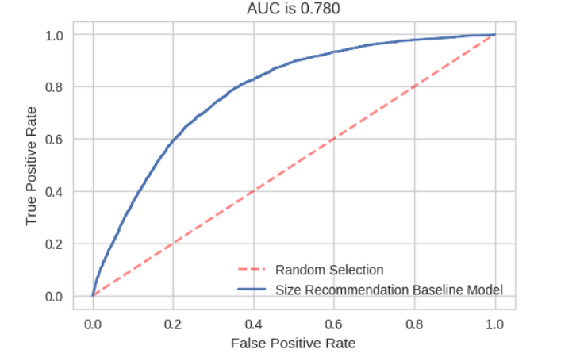
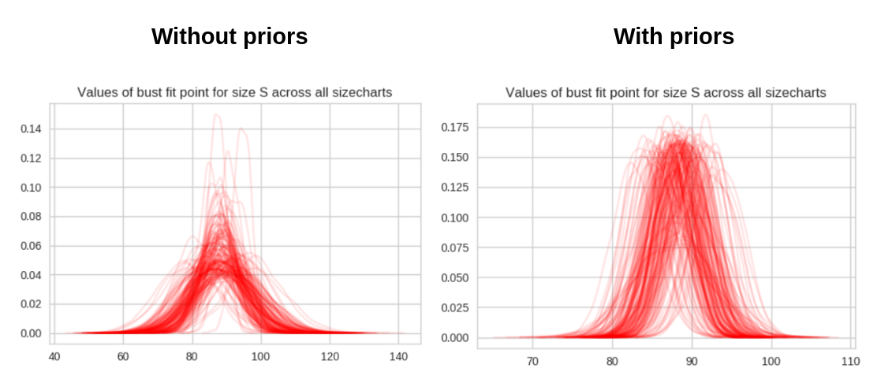

The conundrum of size vs. fit continues to plague online shoppers and in turn, retailers. The iteration of purchase, retention / return and re-purchse is an opportunity for retailers to learn customer preferences and offer better purchasing advice for future customers. With only transaction and browsing behaviour data, recommendations are a popular offering. However, if retailers can use customer shape data directly, obtained through online fit tools, they can evolve their understanding of size as fit as a pathway for better customer advice. 

The simplest option is to remodel the size chart as a  "fit chart". A fit chart begins as a size chart - one that is usually designed by the product team at the retailer / brand. Once the garment is on the site and has associated purchases or returns, the size chart can be re-calculated as a fit chart through a suitable statistical model. Due to the large discrepancy in sales between 'popular' and 'select' items, the statistical model needs to be able to offer useful outcomes with both low and large volumes of sales data. 

A simple normal distribution bayesian model for each fit point of bust, waist and hips is a great starting point. While the model performance is highly dependent on the retailer and customer behaviour combinations, some models were able to attain [AUC](https://en.wikipedia.org/wiki/Receiver_operating_characteristic#Area_under_the_curve) values of 0.78 through this simple move from _size_ to _fit_. 

Extending the simple model to including priors can significantly improve the fit charts. While the choice of a suitable prior can be difficult, the impact of a good and peer-reviewed prior can result in tidier outputs from the model. Even a prior that is an average across all the data can made a difference. For example, the dispersion and widths of the distributions can be reduced significantly. 

