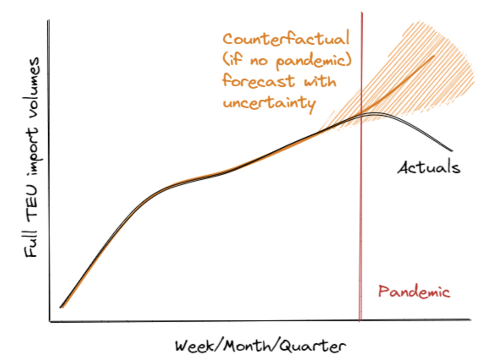
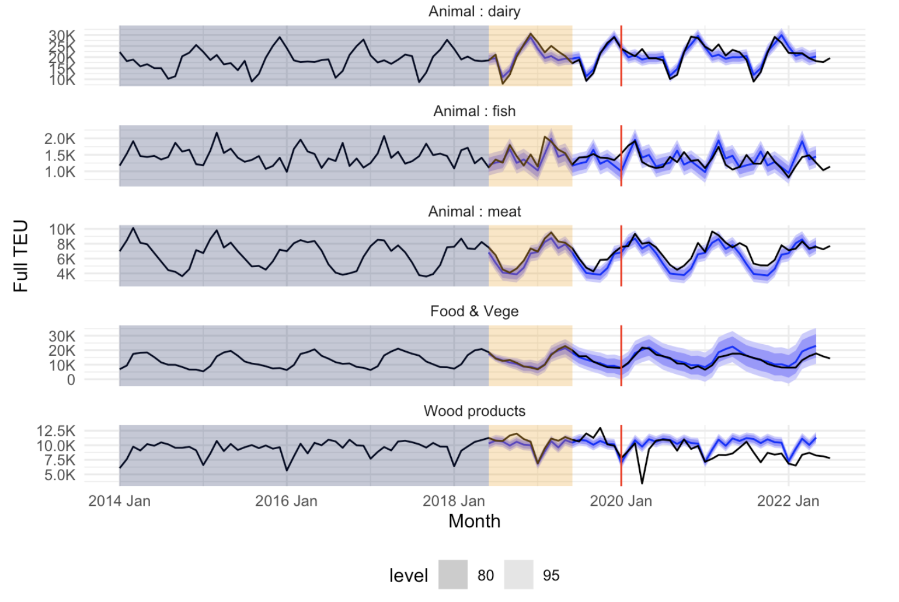

The COVID-19 pandemic has affected economic activity around the world. However, direct impacts cannot be calculated with a comparison between the last pre-pandemic year and current pandemic years. For indicators that respond quickly to singular, large shocks like a global pandemic, one approach for extracting a causal impact is to subtract the actual values from a projected counterfactual generated from trends prior to the shock. 

Easily available economic indicators of container trade, in terms of TEU (twenty foot equivalent units), are used to estimate the causal impact of the global pandemic that started in 2020 since *"..the dynamics of the breakbulk market are related to manufacturing and consumption."* ([Geography of Transport Systems Ch. 5.4.2](https://transportgeography.org/contents/chapter5/maritime-transportation/#2_Maritime_Traffic)) Imports are connected to consumption (demand) while exports link to manufacturing (supply as a response to external demand). 

For container imports, the counterfactual predictions from an [ETS](https://otexts.com/fpp3/expsmooth.html) (exponential smoothing) model show that most of 2020 volumes were considerably below expected. From 2021, the predictions and the actuals fall in a little closer together possibly indicating some recovery. 

Overall exports show no clear trend since New Zealand exports primary products - each with different seasonalities and trends. Instead, exports need to be modelled separately by commodity. Wood products show the greatest reductions and ongoing dampening while food commodities have seen little change to expectations. 

#### Disclaimer
The contents and figures in this post are not official outputs from the Ministry of Transport. They are research-oriented exploratory analyses intended as demonstrations of approaches and techniques relevant to public sector data science. 