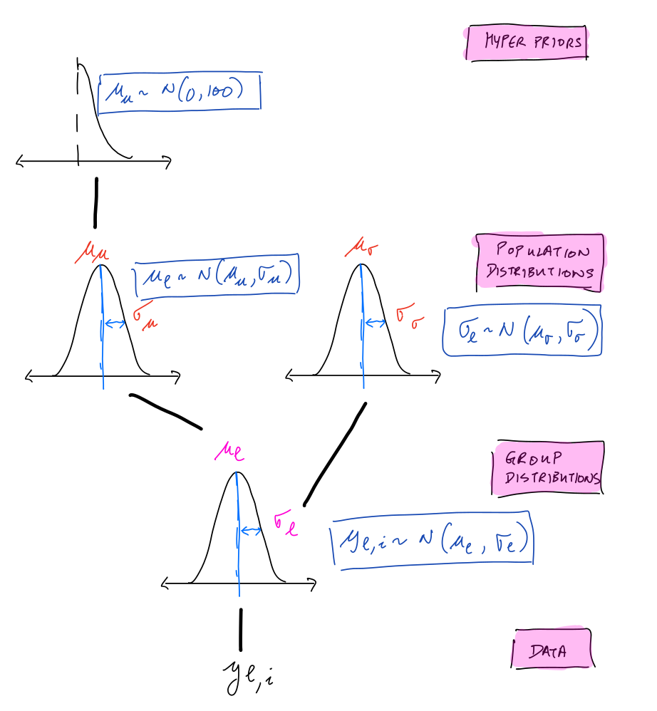
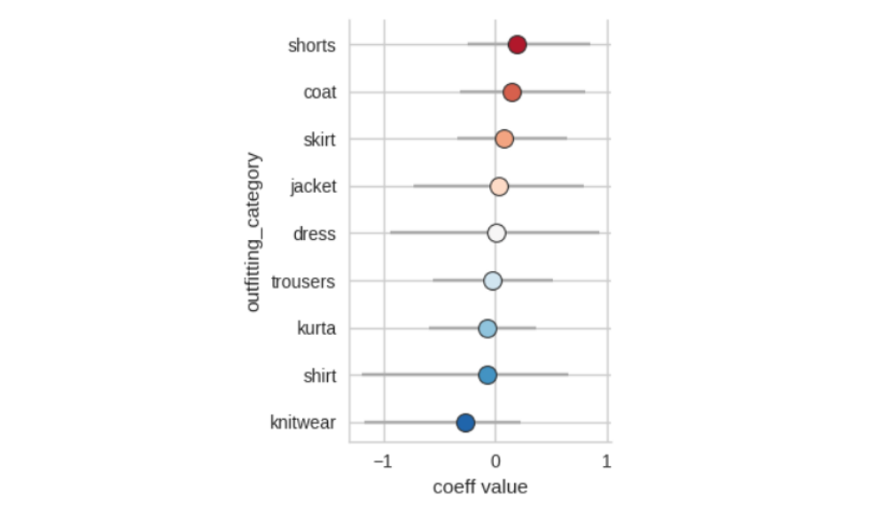

A simple model usually assumes no grouping or structure in the data. However, real world processes often have clear hierarchy and structure. For example, Brand A shirts will be more similar to Brand B shirts than Brand A trousers. Thus, a natural extension to modelling fit is to incorporate a hierarchical structure allows that modelling of categories that closely emulate reality like garment type, fit type (slim, regular, plus) or brand. For example, a single model for all size charts that sell shirts and individual models for each brand. 

The advantage of hierarchical modelling is that the population average becomes a prior for all the groups. This results in an effect called _shrinkage_ - where groups with low observations are more strongly pulled towards the population values. The shrinkage effect is very useful in real world applications since the advice given to customers maintains an average statsus quo until there is sufficient data to deviate. 

More than one level in the model hierarchy requires a re-structuring of the model as a 'multilevel' structure - where all the levels are a _shift_ from a mean value. A forest plot visualisation of fit coefficients can offer both quantitative and domain insight. In _fit_ terms the plot can be interpreted as knitwear having more tolerance and generally accomodating more shapes while shorts and coats fit _smaller_ than the average across all garments. 

