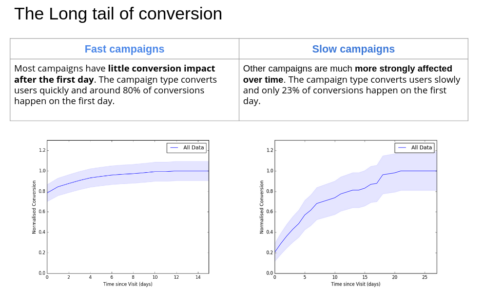

Customer analytics is a multidisciplinary field of marketing techniques, causal methods and market research - mostly towards the aim of getting us to open our wallets a little more. While this aim is ethically ambiguous to some, the technical side is rich and ripe for bringing in statisitcal techniques used extensively in other disciplines for additional information and insight. 

One useful method for working with customer data is survival analysis. Heavily used within insurance, it is a useful set of models that take time series data of activity and return a probability of 'survival' to that point in time, and continued survival. For example, we can take a time series of a customer's visits to a website and get their probability over time of being a visitor. 

Survival analysis with visits data is well used by product managers to understand their 'live' users but it has utility outside this application. I was able to use it to better understand the lifetime of "online events" like marketing campaigns. The typical analysis of marketing campaign success is to aggregate all the views of campaign pages and their linked purchases to calculate a single, overall conversion rate for it. However, I found that changing the perspective of a single conversion rate to _time series of conversion proability_ brings deeper understanding of conversion of campaign lifetimes and whether they influence users to purchase quickly or mull over their decision over some period of time. While this can be conflated with set times for campaigns, it is a useful tool for campaigns that last some period of time rather than one day sales type campaigns. 

