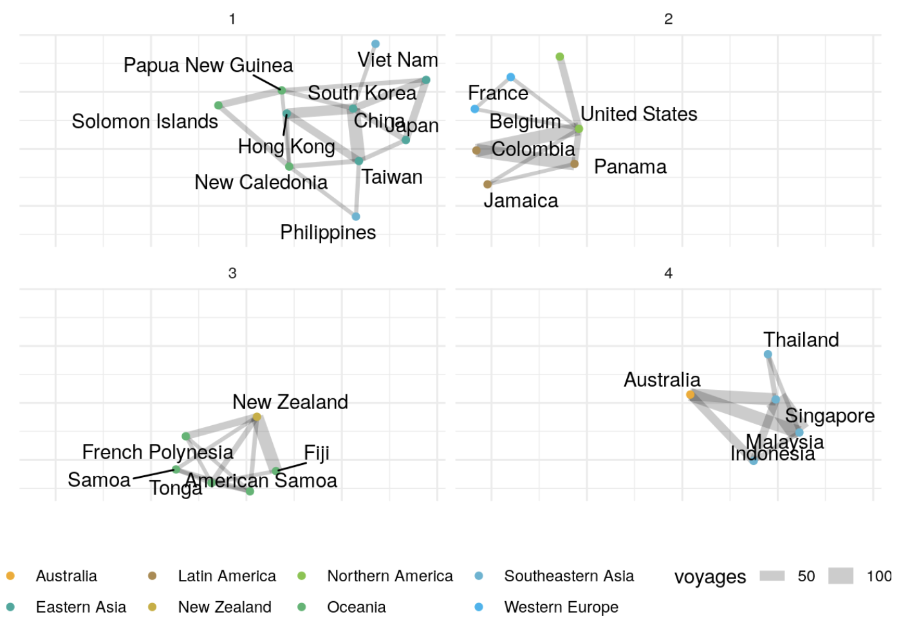

Knowing where ships go in order to connect New Zealand to global trading partners provides a qualitative picture of maritime connectivity. We can understand that we are qualitatively well connected to Australia, Southeastern Asia and Eastern Asia. But how much? Are we better connected via maritime links to some partners than others? 

Network analysis offers one way to answer these questions. Networks are a common technical approach in many domains as they reduce information in a way that identify otherwise hidden patterns and structures. Instead of looking at the strength of trade connections based on value and quantity of trade goods, we look at the structure of the maritime network that will deliver these goods. 

The same port visits data that can [build ship schedules](https://shriv-portfolio.netlify.app/project/shipping-schedules/) or [understand shipping delays](https://shriv-portfolio.netlify.app/project/shipping-delays/) can also find patterns of maritime connectivity. Nodes, aggregated to countries for convenience, are connected by ship voyages. Direct connections indicate adjacent ports in the visit sequence while indirect connections are either ports further along the schedule or connected by common ports on different routes. 

The relative strength of adjacent connections vs. connections further away is a handy way to split the network into communities. Like social networks, communities of strongly connected nodes are more likely to share information and cooperate, or in more dire circumstances, fail together. 

#### Disclaimer
The contents and figures in this post are not official outputs from the Ministry of Transport. They are research-oriented exploratory analyses for policymaking. 