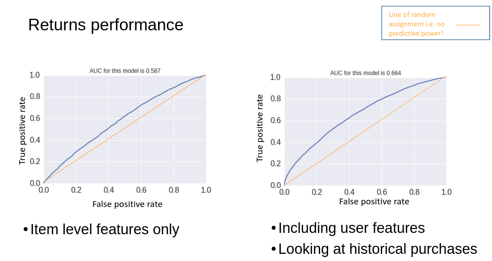

Returns are an inevitable consequence of spatial and temporal separation of purchase from physical interation with the item. Despite advanced multimedia in presenting item characteristics to the customer, there is still a fundamental lack of tactile understanding. The importance of such an understanding is both a function of customer preference and item characteristics. The physical feel and wear of some items are inherently harder to communicate and, customers' themselves have different preferences of what they expect from the photos and videos. As a result, returns are usually distributed. The shape and extremes of returns are, of course, variable depending on the item type and the brand / retailer! 

The level of variability in returns prompts a desire to understand _why_ returns happen in the first place. For garments at a particular retailer, two simple returns models allowed dissemination of how items and customer characteristics contribute to when returns happen. The model showed that returns are more unpredictable than expected and item details alone are not sufficient. Some features based on customer behaviours lift prediction accuracy considerably. However, the interaction between items and customers is an important missing piece of the returns puzzle! 

