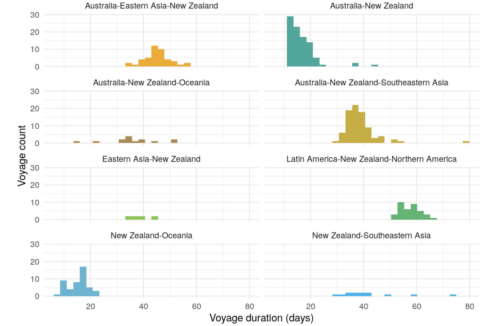
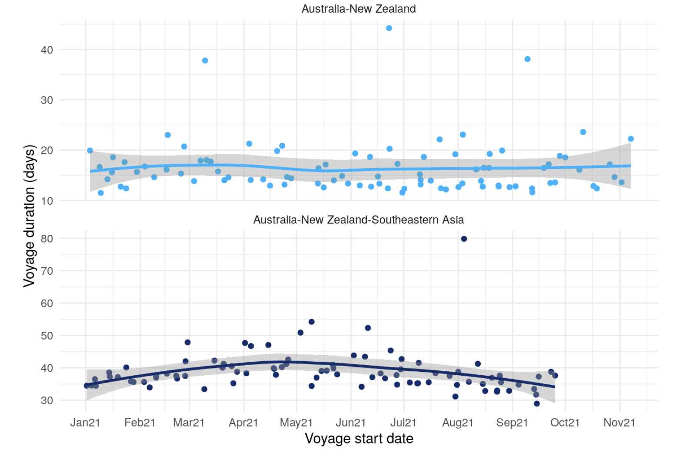

The movement of ships and depdendence on international ports has been left to the market by New Zealand policymakers. That is, competitive market forces will converge on optimal routes given maritime network structure, demand and port capacity / attractiveness. However, a cascading set of labourforce disruptions and stringent COVID-19 policies have resulted in significant delays to container ship voyages since the onset of the global pandemic. 

Given New Zealand's geographical position as well as its wide set of trading partners, we see considerable variation in both the absolute value as well as the shape of voyage durations. Longer routes like `Australia-Eastern Asia-New Zealand` and `Latin America-New Zealand-Northern America` have the most stable shape (symmetric Gaussian/Lorentzian) while voyages on the considerably closer Trans-Tasman route (`Australia-New Zealand`) are heavily skewed. A long tail is also seen for voyages on the important `Australia-New Zealand-Southeastern Asia` route, connecting New Zealand to key trans-shipment hubs like Singapore and Port Klang. 

We can zoom into the temporal patterns for voyages in the two problematic routes. Both display different reasons for issues. For Trans-Tasman voyages, delays have no clear pattern. For voyages to Southeastern Asia, voyage durations peaked between April - June 2021 before decreasing again.

#### Disclaimer
The contents and figures in this post are not official outputs from the Ministry of Transport. They are research-oriented exploratory analyses for policymaking. 