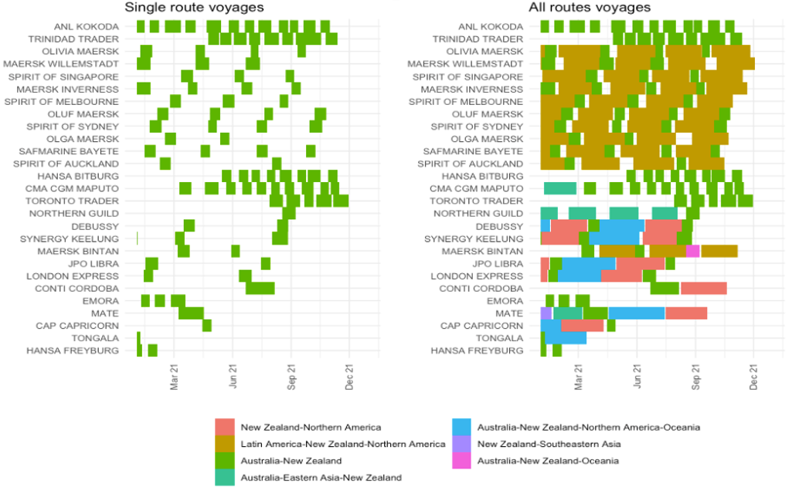
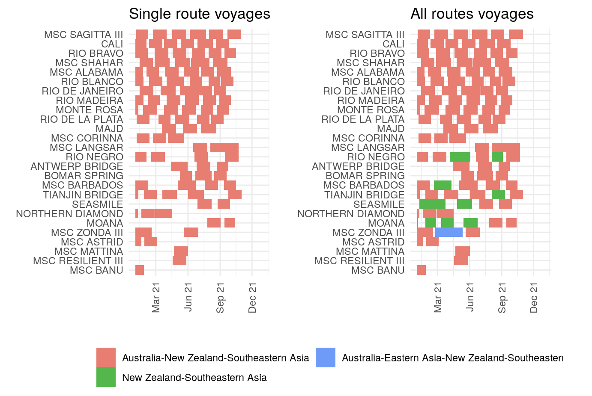

One of the challenges in the public sector is getting high level understanding of operational aspects without requiring commercially sensitive data or extensive negotiations to get consistent data from many commericial providers. 

Since the COVID-19 pandemic, policymakers have needed information on ship schedules to and from New Zealand to derive contextual understanding of trade capacity over time without the specificity of commercial offerings from shipping lines. 

Enriching a comprehensive data source like AIS (Automatic Identification System) with industry-relevant concepts like voyages and routes (see [blog post](https://shriv-portfolio.netlify.app/post/maritime-data-enrichment/)) allows us to build retrospective ship schedules from a single data source. Simple visualisations summarise the relevant information for policymakers to easily compare ships doing differents and the proportion of time they spend on a voyage that includes New Zealand. 

For example, we see that around a third of ships that made any Trans-Tasman (`Australia-New Zealand`) voyage in 2021 also do the much longer `Latin America-New Zealand-Northern America` routes in between. Only a handful of ships do purely Trans-Tasman voyages for an extended period of time. 

A completely different pattern exists for ships that have done a `Australia-New Zealand-Southeastern Asia` route. For these ships, around half run regularly on this route route while another quarter run a variant that only drops Australian ports on the voyage. 

#### Disclaimer
The contents and figures in this post are not official outputs from the Ministry of Transport. They are research-oriented exploratory analyses intended as demonstrations of approaches and techniques relevant to public sector data science. 