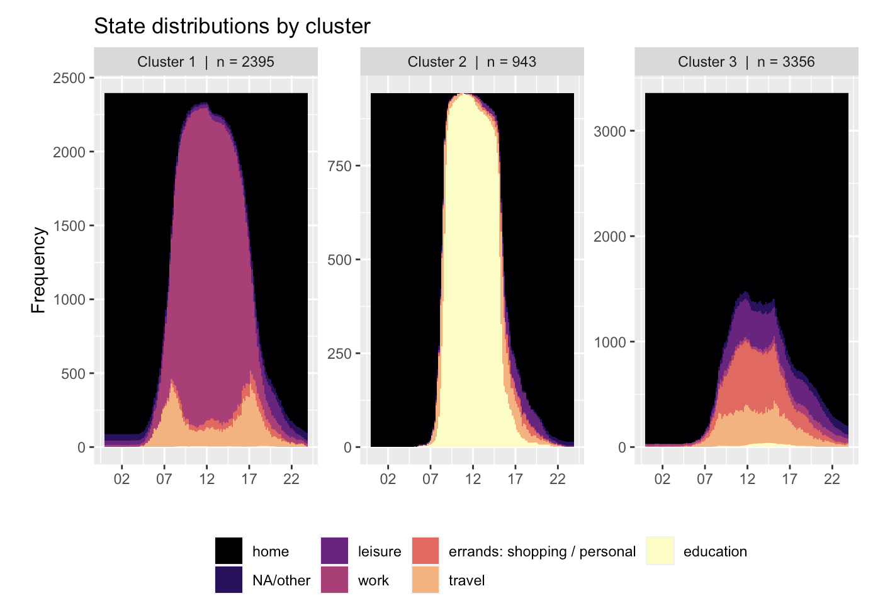
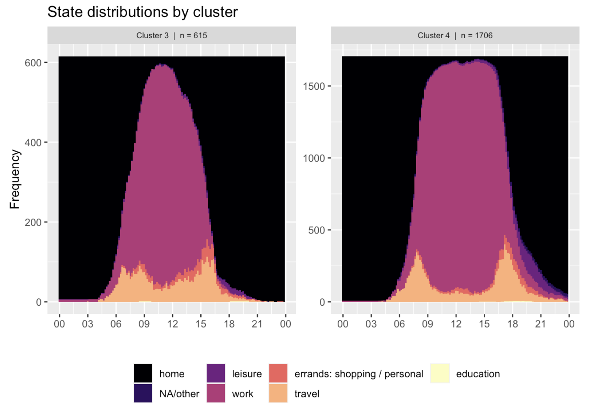

Transport policy that aims to modify travel or activity behaviour must first understand what people do, how, why and with whom. Without it policymakers risk introducing misaligned policies to the desired behaviour change or creating asymmetric distributional impact where some groups are considerably more disadvantaged than others. 

However, understanding the intracies of daily travel and activity behaviour is a high dimensional problem requiring reduction in complexity before it becomes useful for testing policy impacts. 

Clustering is a common approach that both reduces complexity in the data as well as creating additional meaning from the clusters themselves. With the addition of sequence analysis we can preserve temporal information of activity patterns while allowing individual variability to be aggregated as clusters / typologies. The individuals within the clusters can be joined back to the person dataset for distributional impact analyses. 

Almost 6,700 days of daily activities done by ~3000 individuals in one year of data (2017) collected by the Household Travel Survey can be neatly summarised into three daily typologies.

1.  Work commuting
2.  Education
3.  Mainly, home, errands and leisure

Generating splits further down the dendrogram can unearth more nuance. For example, Work commuting cluster splits into two additional typologies: 

1. Earlybirds at work with diffused morning and evening commuting times. 
2. Regular 9-5ers with a a strong single morning and evening commute peak at 8 am and 5:30 pm respectively

#### Disclaimer
The contents and figures in this post are not official outputs from the Ministry of Transport. They are research-oriented exploratory analyses for policymaking. 